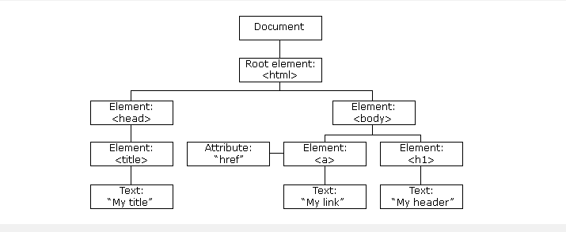
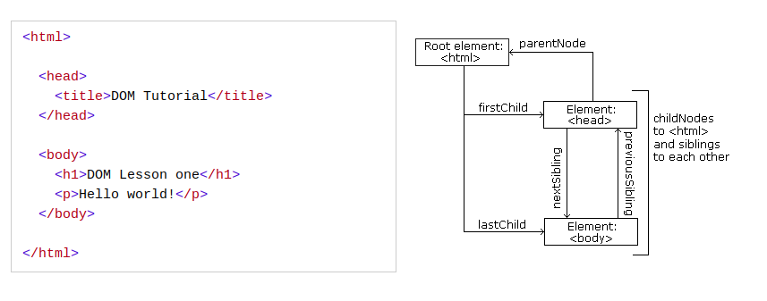

# Tìm hiểu về HTML DOM 
## 1.INTRO 
* Với HTML DOM thì JS có thể thay đổi được toàn bộ hiển thị của `element` trong HTML 
* Khi mà một trang web được load thì trình duyệt sẽ tạo ra một  `document object model`. Và được xây dựng theo mô hình cây 



* Với một `object model` thì JS có tất cả điều cần thiết để tạo ra HTML động :
    * JS có thể thay đổi tất cả các `HTML element` trong trang 
    * Có thể thay đổi tất cả `attributes` 
    * JS có thể thay đổi tất cả style   CSS 
    * JS có thể xóa `HTML element` và `attributes` đã có sẵn 
    * JS có thể thêm mới `HTML element` và `attribute` 
    * JS có thể `react` tất cả `HTML event` trong trang 
    * JS có thể tạo mới `HTML event` trong trang 
* DOM là một tiêu chuẩn W3C
* DOM định nghĩa để truy cập document
* DOM được chia thành 3 phần : 
    * Core DOM
    * XML DOM 
    * HTML DOM 
* HTML DOM là tiêu chuẩn của `object model` và `programming interface` cho HTML. Nó định nghĩa 
    * HTML elements làm object
    * `Properties` của tất cả `HTML elements` 
    * `Event` cho tất cả `HTML elements` 
    * `Method` cho tất cả truy cập `HTML elements` 

## 2. DOM METHOD 
* HTML DOM method là hành động có thể dùng để tác động vào `HTML elements`
* HTML DOM properties là giá trị của `HTML elements` mà nó có thể cài đặt và thay đổi 
* HTML DOM giao diện lập trình 
    * HTML DOM có thể truy cập được bằng JS 
    * Trong DOM tất cả các HTML `elements` được coi là `object` 
    * `Program interface` là `properties` và `method` của `object`
    * `Property` là giá trị mà bạn có thể lấy ra hoặc cài đặt 
    * `method` là hành động có thể thực hiện được 
```js
<p id="demo"></p>

<script>
document.getElementById("demo").innerHTML = "Hello World!";
</script>
```
* Trong đó : 
    * `document.getElementById` : là method
    * `innerHTML` : là property
* Để có thể truy cập được một `HTML elements` thường sử dụng đến `id` của chúng
* Các dễ nhất để lấy được nội dung của `HTML elements` là sử dụng `inner HTML`. 

## 3. DOM DOCUMENT 
* HTML DOM Document là chủ sở hữu của tất cả các `object` trong trang web
* HTML DOM document object như là một đại diện của trang web
* Nếu muốn sử dụng tài nguyên thì luôn phải bắt đầu bằng `document` 

| Method |	Description |
| --- | --- |
| document.getElementById(id) |  Tìm một phần tử theo ID |
| document.getElementsByTagName(name) | Tìm element theo tag  |
| document.getElementsByClassName(name) | Tìm   element theo class |

* Thay đổi các HTML element

| Property |	Description |
| --- | --- |
| element.innerHTML =  new html content | thay đổi nội dung bên trong HTML element |
| element.attribute = new value	 | thay đổi attribute của HTML element |
| element.style.property = new style | thay đổi style của HTML element |
| element.setAttribute(attribute, value) | thay đổi giá trị của attribute |

* Thêm và xóa HTML element 

| Method |	Description |
| --- | --- |
| document.createElement(element) | Tạo ra  HTML elements mới |
| document.removeChild(element)	| Xóa  HTML element |
| document.appendChild(element)	 | Thêm một HTML element |
| document.replaceChild(new, old)	| Thay đổi HTML element |
| document.write(text)	| Tạo ra một output | 
| document.getElementById(id).onclick = function(){code}	| Thêm action vào một event |

Tìm hiểu thêm về các [HTML object](https://www.w3schools.com/js/js_htmldom_document.asp) 

## 4. HTML DOM ELEMENT 
Để có thể thao tác đến các `HTML element` thì ta cần phải tìm được chúng. Có một số cách làm được:
* Tìm theo `ID` 
```js
var myElement = document.getElementById("intro");
```
* Tìm theo `class` 
```js
var x = document.getElementsByClassName("intro");
```
* Tìm theo thẻ  
```js
var x = document.getElementsByTagName("p");
```
* Tìm theo CSS `selector`
```js
var x = document.getElementsByClassName("intro");
```
* Tìm theo `HTML object collections`
```js
ar x = document.forms["frm1"];
var text = "";
var i;
for (i = 0; i < x.length; i++) {
  text += x.elements[i].value + "<br>";
}
document.getElementById("demo").innerHTML = text;
```

## 5. DOM HTML 
* DOM HTML cho phép JS thay đổi toàn bộ nội dung của HTML element 
* Trực tiếp tạo ra output với `document.write()`
```js
document.write(Date());
```
* Thay đổi nội dung HTML
```js
document.getElementById("p1").innerHTML = "New text!";
```
* Thay đổi giá trị thuộc tính. Thay đổi ảnh của thẻ `img` 
```js


<script>
document.getElementById("image").src = "landscape.jpg";
</script>
```

## 6. DOM CSS
* DOM có thể thay đổi được CSS style của `HTML element`
```js
document.getElementById("p2").style.color = "blue";
```
* HTML DOM cho phép thực hiện action khi có sự kiện xảy ra. Các sự kiện xảy ra khi có thao tác với `HTML elements` 
    * Khi có click 
    * khi load hết trang 
    * khi input thay đổi 
```js
<button type="button"
onclick="document.getElementById('id1').style.color = 'red'">
Click Me!</button>
```
##  7. DOM Animation
* Tạo ra hình ảnh động trong JS 
* Nó được tạo ra nhờ thay đổi style của `html element` dần dần. Và khoảng thời gian giữa chúng nhỏ nên giống như là một hình ảnh động 
```js
function myMove() {
  var elem = document.getElementById("animate");
  var pos = 0;
  var id = setInterval(frame, 5);
  function frame() {
    if (pos == 350) {
      clearInterval(id);
    } else {
      pos++;
      elem.style.top = pos + 'px';
      elem.style.left = pos + 'px';
    }
  }
}
```

## 8. DOM event 
* HTML DOM cho phép JS được thực thi khi có sự kiện HTML xảy ra 
* Để có thể thực thi sự kiện cho `HTML elements` thì ta cần sử dụng `attribute`(thuộc tính) sự kiện
* Tìm hiểu về tất cả các thuộc tính sự kiện [tại đây](https://www.w3schools.com/jsref/dom_obj_event.asp)
* Để có thể thực thi thì cần thêm code JS vào HTML event attribute
```js
onclick= code-JS
```
```
<h1 onclick="this.innerHTML = 'Ooops!'">Click on this text!</h1>
```
* Sự kiện `onload` được dùng khi người dùng truy cập vào trang 
* Sự kiện `onunload` được dùng khi người dùng rời khỏi trang 
* Hai sự kiện trên có thể được sử dụng với cookie 
* Sự kiện `onchange` thường được sử dụng kết hợp với việc xác nhận đầu vào 
```js
<input type="text" id="fname" onchange="upperCase()">
```
* Sự kiện `onmouseover` được dùng cho việc di con trỏ chuột tới `HTML element`
* Sự kiện `onmouseout` được sử dụng cho di chuột ra khỏi `HTML element`
* Sự kiện `onmousedown` được thực hiện khi đang nhấn và giữ chuột
* Sự kiện `onmouseup`    được thực hiện khi đã click xong

## 9. DOM EventListener
* Method `addEventListener()` được sử dụng để gán sự kiện cho một `HTML elements` được chỉ định
```js
document.getElementById("myBtn").addEventListener("click", displayDate);
```
* Nó sẽ ghi thêm sự kiện chứ không phải ghi đè lên sự kiện hiện có
* Có thể có nhiều sự kiện trong một HTML elements 
* Khi sử dụng method `addEventListener()` thì JS và HTML thường được để riêng ra để dễ đọc hơn 
* Cũng có thể remove một sự kiện bằng method `removeEventListener()` 
* Cú pháp 
```js
element.addEventListener(event, function, useCapture);
```
* Trong đó : 
  * `event` : là loại sự kiện của [HTML event](https://www.w3schools.com/jsref/dom_obj_event.asp)
  * `function` : Là function thực hiện action khi mà sự kiện xảy ra
  * `useCapture` : là tham số thứ 3 xem nên sử dụng `event bubbling` hay là `event capture` 

```js
element.addEventListener("click", myFunction);

function myFunction() {
  alert ("Hello World!");
}
```

* Thêm nhiều trình sự kiện vào một phần tử 
```js
var x = document.getElementById("myBtn");
x.addEventListener("click", myFunction);
x.addEventListener("click", someOtherFunction);

function myFunction() {
  alert ("Hello World!");
}

function someOtherFunction() {
  alert ("This function was also executed!");
}
```

Event Bubbling và Event Capturing
* Đây là 2 cách truyền sự kiện trong HTML DOM. Truyền sự kiện sẽ xác định xem thứ tự nào sẽ được thực hiện trước 
* Bubbling thì thứ tự thực hiện sẽ là từ các `elemetns` ở trong ra đến bên ngoài. ví dụ như là sẽ thực hiện từ thẻ `<p>` trước rồi đến thẻ `<div>` 
* Còn khi chọn `Capturing` thì thứ tự thực hiện của nó sẽ ngược lại so với `bubbling` 
* Giá trị sẽ thuộc dạng boolean `bubbling` = `false` và ` true` = `Capturing` 
```js
document.getElementById("myP").addEventListener("click", myFunction, true);
```

## 10.DOM NODES 
* Theo tiêu chuẩn của W3 thì mọi thứ trong HTML đều là node :
  * Mỗi một `element` là một node
  * Text bên trong một `elements` được gọi là `text node` 
  * Tất cả comment là `comment node` 
  * Mỗi `attribute` là một `attribute node` 
  * Tất cả các node đều có thể được truy cập bằng JS 
  * Các node có thể được sửa xóa hoặc là tạo mới
* Node Relationships
  * Các node trong hệ thống có quan hệ phân cấp với nhau
  * Các từ ngữ dùng để miêu tả là : parent; child và sibling
  * Trong một hệ thống node trên cùng được gọi là root
  * Mỗi node có một node parent 
  * Mỗi node có thể có nhiều child 
  * sibling là các node có cùng parent 



* Có thể sử dụng node properties :
  * parentNode
  * childNodes[nodenumber]
  * firstChild
  * lastChild
  * nextSibling
  * previousSibling

```js
<title id="demo">DOM Tutorial</title> // đây được gọi là một node 
```
* Trong ví dụ thì `DOM Tutorial` được gọi là `text node`
* Có 2 `properties` được sử dụng để truy cập toàn bộ tài liệu: `document.documentElement` và `document.body ` 
* Sử dụng `nodeName` để chỉ định tên của một node 
  * nodeName chỉ có thể đọc
  * nodeName là một `node elements` 

* `nodeValue` chỉ định giá trị của một node 
  * `nodeValue` của một element là `null`
  * `nodeValue` của text node là text
  * `nodeValue` của attribute chính là giá trị của nó 

* `nodeType` trả về kiểu của một node 
```js
<h1 id="id01">My First Page</h1>
<p id="id02"></p>

<script>
document.getElementById("id02").innerHTML = document.getElementById("id01").nodeType;
</script>
```

* Tạo ra một HTML elements (node)
```html 
<div id="div1">
  <p id="p1">This is a paragraph.</p>
  <p id="p2">This is another paragraph.</p>
</div>

<script>
var para = document.createElement("p");
var node = document.createTextNode("This is new.");
para.appendChild(node);

var element = document.getElementById("div1");
element.appendChild(para);
</script>
```

* Xóa đi một phần tử 
```html 
<div>
  <p id="p1">This is a paragraph.</p>
  <p id="p2">This is another paragraph.</p>
</div>

<script>
var elmnt = document.getElementById("p1");
elmnt.remove();
</script>
```

* Thay đổi HTML element 
```html
<div id="div1">
  <p id="p1">This is a paragraph.</p>
  <p id="p2">This is another paragraph.</p>
</div>

<script>
var para = document.createElement("p");
var node = document.createTextNode("This is new.");
para.appendChild(node);

var parent = document.getElementById("div1");
var child = document.getElementById("p1");
parent.replaceChild(para, child);
</script>
```
* Node list : là tập hợp danh sách các node trên một tài liệu HTML 
  * `NodeList` giống như là một HTMLcollection
  * Khi sử dụng `childNodes` thì kết quả trả về là một nodelist
  * Khi sử dụng method `querySelectorAll()` thì kết quả trả về là một nodelist
  * Một `nodelist` có thể truy cập bằng chỉ mục 
```js
var myNodeList = document.querySelectorAll("p");
y = myNodeList[1];
```

| HTMLCollection | NodeList |
|---|---|
| Là một danh sách các `HTML element` | Là danh sách các `document node` |
| Có thể truy cập bằng tên; id ; hoặc chỉ số mục | Chỉ có thể truy cập bằng chỉ số mục |

