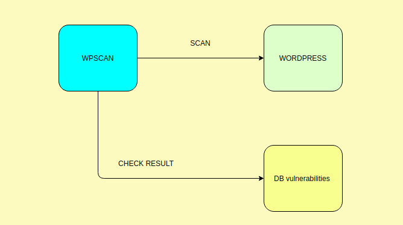

# Tìm hiểu về wpscan 
##  Tổng quan về wpscan 
### 1. Khái niệm 
* `WPSCAN` là viết tắt của `wordpress scan`. Đây là một tool thường được sử dụng để scan các lỗ hỏng ở trên các website sử dụng wordpress. 
* `WPSCAN` được viết cho những người muốn bảo vệ site của họ và kiểm tra tính bảo mật website của họ 
* `WPSCAN` được viết bằng ngôn ngữ lập trình `ruby` và phiên bản đầu tiên được phát hành vào 16 tháng 6 năm 2011. Và phiên bản stable hiện này là 3.8.1
### 2. Luồng làm việc wpscan
* `Tool wpscan` : sẽ được sử dụng để check các version của wordpress như là phiên bản wordpressđang được sử dụng. Phiên bản của các plugin đang được sử dụng....
* `Site wordpress` : Là một trang website được sử dụng wordpress 
* `DB Vulnerabilities` : Là DB các lỗ hỏng được đã được phát hiện và được tập hợp lại. `wpscan` sẽ check lại xem có lỗ hỏng nào giống như trong DB không sẽ báo lại với người sử dụng wpscan 



* Bước 1: Tool wpscan sẽ chạy và check các thông tin về wordpress. 
* Bước 2: Sau đó kết quả sẽ được wpscan thu lại. Và nó sẽ sử dụng kết quả đó để check với DB Vulnerabilities
* Bước 3: Sau khi check xong với DB thì nếu như có lỗ hỏng nào được phát hiện nó sẽ trả về các lỗ hỏng đó hiển thị lên màn hình 

### 3. Cài đặt wpscan 
* Có thể cài đặt được wpscan trên nhiều hệ điều hành khác nhau. Đều có thể cài đặt trên các hệ điều hành phổ biến như là win, Debian, Ubuntu, CentOS...
* Ở trong bài này mình sẽ nói đến hai cách cài đặt đó là trên ubuntu 18.04 và trên centos 7.x

#### Cài đặt wpscan trên ubuntu 18.04. Hãy thực hiện theo các danh sách lệnh dưới đây để cài đặt 
* Cập nhật hệ thống 
```
sudo apt update
sudo apt upgrade
```
* Cài đặt các gói cần thiết cho wpscan 
```
sudo apt install curl git libcurl4-openssl-dev make zlib1g-dev gawk g++ gcc libreadline6-dev libssl-dev libyaml-dev libsqlite3-dev sqlite3 autoconf libgdbm-dev libncurses5-dev automake libtool bison pkg-config ruby ruby-bundler ruby-dev -y
```
* Cài đặt wpscan 
```
gem install wpscan
```
* Kiểm tra xem wpscan đã được cài đặt hay chưa 
```
wpscan -h
```
* Kiểm tra version của wpscan được cài đặt
```
wpscan --version
```
* output 
```
_______________________________________________________________
         __          _______   _____
         \ \        / /  __ \ / ____|
          \ \  /\  / /| |__) | (___   ___  __ _ _ __ ®
           \ \/  \/ / |  ___/ \___ \ / __|/ _` | '_ \
            \  /\  /  | |     ____) | (__| (_| | | | |
             \/  \/   |_|    |_____/ \___|\__,_|_| |_|

         WordPress Security Scanner by the WPScan Team
                         Version 3.8.1
       Sponsored by Automattic - https://automattic.com/
       @_WPScan_, @ethicalhack3r, @erwan_lr, @firefart
_______________________________________________________________

Current Version: 3.8.1
Last DB Update: 2020-05-20

```

#### Cài đặt wpscan trên centos 7
* Các điều kiện cần thiết khi cài đặt một số gói trên centos 7 là:  
    * Ruby >= 1.9.2
    * Curl >= 7.21 
    * RubyGems > 2.3+
    * cài đặt git 
* Cài đặt curl 
```
yum install curl -y 
```
* Kiểm tra version của curl xem đúng điều kiện hay chưa
```
[root@localhost ~]# curl -V
curl 7.29.0 (x86_64-redhat-linux-gnu) libcurl/7.29.0 NSS/3.44 zlib/1.2.7 libidn/1.28 libssh2/1.8.0
Protocols: dict file ftp ftps gopher http https imap imaps ldap ldaps pop3 pop3s rtsp scp sftp smtp smtps telnet tftp 
Features: AsynchDNS GSS-Negotiate IDN IPv6 Largefile NTLM NTLM_WB SSL libz unix-sockets
```
* Cài đặt gói cần thiết 
```
yum install gcc-c++ patch readline readline-devel zlib zlib-devel libffi-devel \
 openssl-devel make bzip2 autoconf automake libtool bison sqlite-devel
```
* Cài đặt rvm 
```
curl -sSL https://rvm.io/mpapis.asc | gpg2 --import -
curl -sSL https://rvm.io/pkuczynski.asc | gpg2 --import -
```
* Cài đặt phiên bản stable nhất của rvm 
```
curl -L get.rvm.io | bash -s stable
```
* Tải môi trường rvm 
```
source /etc/profile.d/rvm.sh
rvm reload
```
* Kiểm tra xem tất cả các cài đặt đã đúng hay chưa
```
[root@localhost ~]# rvm requirements run
Checking requirements for centos.
Requirements installation successful.
```
* Tìm các phiên bản ruby có thể cài đặt 
```
rvm list known
```
* Sau đó cài đặt phiên bản mà mình muốn với điều kiện bài này là > 2.3 
```
rvm install 2.7
```
* Thiết lập phiên bản mặc định
```
rvm use 2.7 --default
```
* Kiểm tra phiên bản đang hoạt động 
```
ruby --version
```
* Cài đặt các gói cần thiết còn lại 
```
yum -y install gcc ruby-devel rubygem-bundler libxml2 libxml2-devel libxslt libxslt-devel libcurl-devel patch git
```
* Tạo thư mục chưa tool wpscan rồi clone wpscan về thư mục đó 
```
mkdir -p /root/tools
cd /root/tools
git clone https://github.com/wpscanteam/wpscan.git
```
* Cài đặt wpscan 
```
cd wpscan
bundle install && rake install
```
* Sau khi cài đặt xong thử lệnh để kiểm tra xem cài đặt được hoàn thành chưa 
```
wpscan -h
```
* update wpscan 
```
wpscan --update
```

### Tìm hiểu cách sử dụng các option wpscan 
* Để có thể đọc cách sử dụng wpscan sử dụng lệnh 
```
wpscan wpscan -h
```
* Kiểm tra version hiện tại của wpscan 
```
wpscan --version
```

# Tài liệu tham khảo 
https://community.centminmod.com/threads/

how-to-install-wpscan-vulnerability-scanner-for-wordpress.5549/

https://kifarunix.com/install-use-wpscan-wordpress-vulnerability-scanner-ubuntu-18-04/

https://github.com/wpscanteam/wpscan/wiki/WPScan-User-Documentation

https://github.com/wpscanteam/wpscan