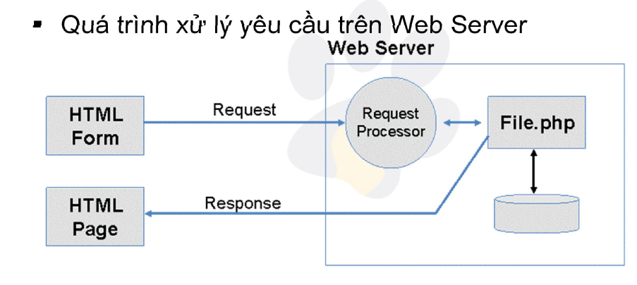

# Form  trong PHP 
Ví dụ về một form trong PHP 
```php
<html>
<body>

<form action="welcome_get.php" method="get">
Name: <input type="text" name="name"><br>
E-mail: <input type="text" name="email"><br> 
<input type="submit">
</form>

</body>
</html>
```
- Trong việc luân chuyển dữ liệu ở PHP thì có 2 method đưuọc sử dụng là $_POST và $_GET. Để việc di chuyển dữ liệu này dễ dàng hơn thì có ác form để thực hiện nó.
- Quá trình xử lý yêu cầu form trên Web Server 



- Khi tạo form thì cần thêm thuộc tính `action` và chỉ rõ phương thức gửi dữ liệu từ client tới server là `POST` hay `GET`
- Biến `$REQUEST` chứa dữ liệu của biến `$_GET` và `$_POST` và `$_COOKIE`
## I. FORM Handling 
- Trong PHP thường sử dụng HTTP POST và HTTP GET. để thu thập được dữ liệu
- Cả GET và POST đều tạo ra một mảng với các cặp `KEY-VALUE`. Trong đó các cặp `KEY-VALUE` này được sử dụng để điều khiển các form, Chúng thường là dữ liệu của người dùng 
- $_GET và $_POST được gọi là `superglobals` bởi vì chúng có thể được gọi và truy cập ở bất cứ phạm vi nào. 

| GET | POST |
| --- | ---  |
| Các biến của GET được truyền thông qua URL | Các biến của POST được truyền thông qua giao thức HTTP POST |
| Thông tin được gửi từ biểu mẫu được hiển thị cho tất cả mọi người. Dù là key hay value, và nó được giới hạn khoảng 2000 ký tự | Thông tin được gửi không được hiển thị trên thanh URL. và không có giới hạn về lượng ký tự |

## II.Form Validation
- Trong PHP thì việc đầy đủ dữ liệu là cần thiết. Vì vậy cần phải sử dụng xác thực form đã được hoàn thành hay là chưa 
- Các quy tắc xác nhận thường được sử dụng với các giá trị là `Required` bắt buộc phải ghi 
1. Text Fields
- Các trường `name`; `email`; `comment`;.. trong một Form thường được nhập bằng text. Và trong `comment` thường được sử dụng với textarea 
```html
Name: <input type="text" name="name">
E-mail: <input type="text" name="email">
Comment: <textarea name="comment" rows="5" cols="40"></textarea>
```

2. Form elements
```html
<form method="post" action="<?php echo htmlspecialchars($_SERVER["PHP_SELF"]);?>">
...
</form>
```
- Trong ví dụ trên khi mà form được gửi đi thì sẽ được gửi với `method=post`
- `$_SERVER["PHP_SELF"]` là một biết superglobal sẽ trả về tên tệp được thực thi. 

3. Lưu ý trong bảo mật form 
- ` $_SERVER["PHP_SELF"]` Có thể được sử dụng bở các hacker 
```
http://www.example.com/test_form.php/%22%3E%3Cscript%3Ealert('hacked')%3C/script%3E
```
- Nếu như sử dụng PHP_SELF thì trang của bạn có thể bị tấn công bằng XSS(Cross Site Scripting )
- Để có thể tránh bị khai thác `PHP_SELF`. Ta sử dụng hàm `htmlspecialchars()`
```html
<form method="post" action="<?php echo htmlspecialchars($_SERVER["PHP_SELF"]);?>">
...
</form>
```
- Hàm này sẽ biến các ký tự đặc biệt thành các HTML entities. Vì thế  có thể tránh được các cuộc tấn công vào `PHP_SELF`

## Required Fields
- Hầu như trong tất cả các form gửi đi đều chứa dữ liệu của người dùng và có những trường bắt buộc phải điền vào 
- Ta có thể tạo ra code PHP để cảnh báo 
```php
<?php
// Khai báo 
$nameErr = $emailErr = $genderErr = $websiteErr = "";
$name = $email = $gender = $comment = $website = "";

if ($_SERVER["REQUEST_METHOD"] == "POST") {
  if (empty($_POST["name"])) {
    $nameErr = "Name is required"; // Nếu trường name trống sẽ in ra text 
  } else {
    $name = test_input($_POST["name"]);
  }
  
  if (empty($_POST["email"])) {
    $emailErr = "Email is required"; // Nếu trường emial trống sẽ in ra dữ liệu 
  } else {
    $email = test_input($_POST["email"]);
  }
    
  if (empty($_POST["website"])) {
    $website = ""; // Nếu trường website vẫn sẽ để là trống  
  } else {
    $website = test_input($_POST["website"]);
  }

  if (empty($_POST["comment"])) {
    $comment = ""; // Nếu trường comment vẫn sẽ để là trống  
  } else {
    $comment = test_input($_POST["comment"]);
  }

  if (empty($_POST["gender"])) {
    $genderErr = "Gender is required"; // Nếu trường website sẽ in ra dữ liệu 
  } else {
    $gender = test_input($_POST["gender"]);
  }
}
// Dữ liệu đi qua các hàm để tránh bị attack 
function test_input($data) {
  $data = trim($data);
  $data = stripslashes($data);
  $data = htmlspecialchars($data);
  return $data;
}
?>
```

## Form E-mail and URL
- Có rất nhiều cách để có thể giúp việc bảo vệ được form. Ta có thể sử dụng các hàm được hỗ trợ hoặc cũng có thể sử dụng giới hạn dữ liệu đầu vào 
```php
$name = test_input($_POST["name"]);
if (!preg_match("/^[a-zA-Z ]*$/",$name)) {
  $nameErr = "Only letters and white space allowed";
}
```
- Ở ví dụ trên chỉ cho phép dữ liệu vào là các chữ cái và khoảng trắng 

1. Xác thực e-mail
- PHP có cung cấp cách để xác thực mail là sử dụng hàm `filter_var()`
```php
$email = test_input($_POST["email"]);
if (!filter_var($email, FILTER_VALIDATE_EMAIL)) {
  $emailErr = "Invalid email format";
}
```

2. Xác thực URL  
- Trong Xác thực URL thì có cách xem cấu trúc URL có đúng như mẫu được đưa ra hay là không 
```php
$website = test_input($_POST["website"]);
if (!preg_match("/\b(?:(?:https?|ftp):\/\/|www\.)[-a-z0-9+&@#\/%?=~_|!:,.;]*[-a-z0-9+&@#\/%=~_|]/i",$website)) {
  $websiteErr = "Invalid URL";
}
```

## Complete Form 
- Thông thường thì khi ta gửi dữ liệu đi thì các dữ liệu ở trong form sẽ được làm mới
- Nhưng ta có thể  giữ lại các dữ liệu đó tại trong form 
- Để dữ lại được dữ liệu trong các form thì ta cần thêm vào một đoạn code của php sẽ in ra dữ liệu của chúng vào chính form đấy 
```html
<input type="text" name="name" value="<?php echo $name;?>">
```