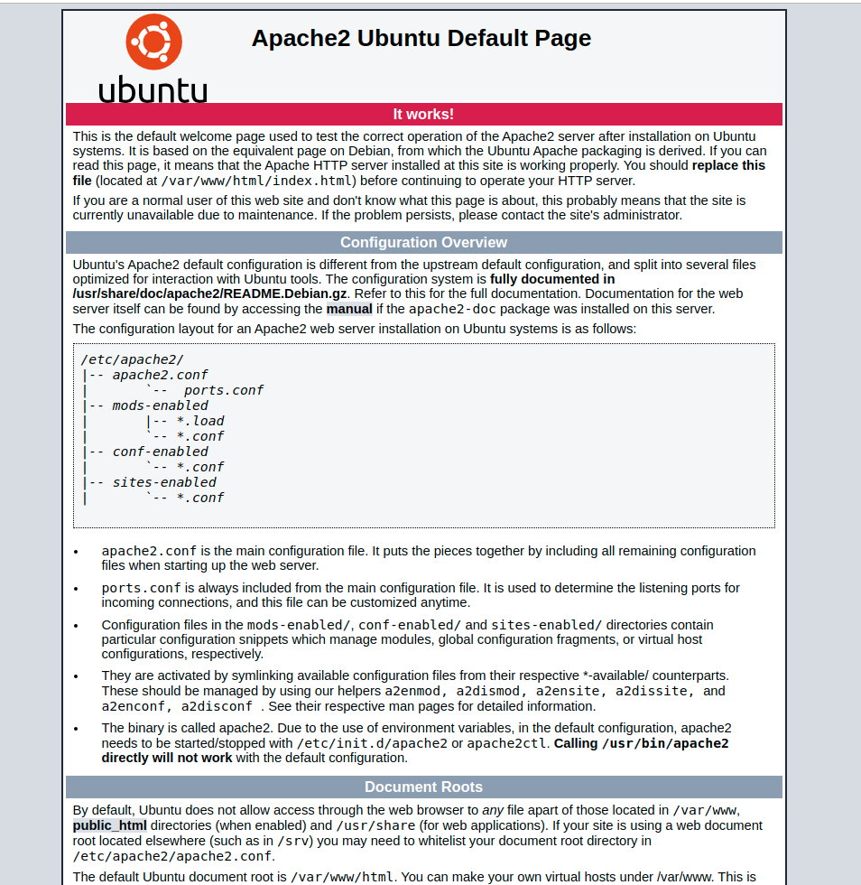
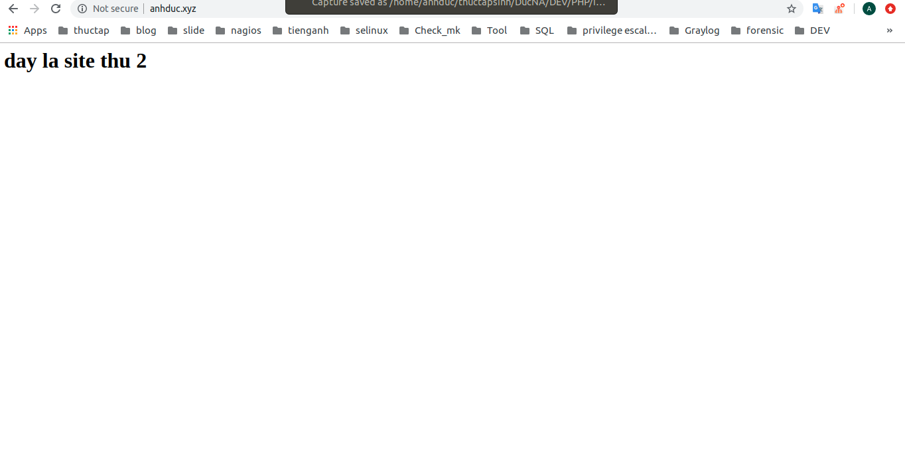
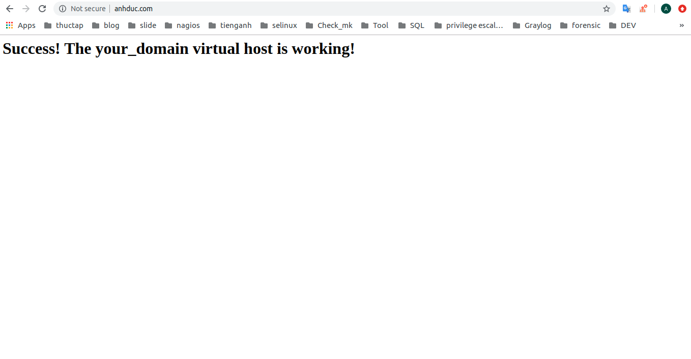

# Hướng dẫn cài đặt Apache lên ubuntu 18.04 
1. Cài đặt Apache 
- Thực hiện lệnh sau để cài đặt 
```
sudo apt install apache2
```
- Khởi động dịch vụ 
```
sudo systemctl start apache2
```
- Kiểm tra trạng thái hoạt động 
```
sudo systemctl status apache2
```
- Đăng nhập thử tới web 



2. Cài đặt site thứ 1
- Tạo thư mục chứa site 1
```
sudo mkdir /var/www/anhduc.com
```
- Gán quyền sở hữu
```
sudo chown -R $USER:$USER /var/www/anhduc.com
```
- Cấp quyền truy cập cho thư mục 
```
sudo chmod -R 755 /var/www/anhduc.com
```
- Tạo ra nội dung cho site 
```
vi /var/www/anhduc.com/index.html
```
Nội dung html 
```
<html>
    <head>
        <title>Welcome to Your_domain!</title>
    </head>
    <body>
        <h1>Success!  The your_domain virtual host is working!</h1>
    </body>
</html>
```
- Tạo ra VM ảo để client truy cập vào 
```
vi /etc/apache2/sites-available/anhduc.com.conf 
```
Nội dung
```
<VirtualHost *:80>
    ServerName anhduc.com
    ServerAlias www.anhduc.com
    DocumentRoot /var/www/anhduc.com
    ErrorLog ${APACHE_LOG_DIR}/error.log
    CustomLog ${APACHE_LOG_DIR}/access.log combined
</VirtualHost>
```
- Cho phép bật nội dung với công cụ a2ensite
```
sudo a2ensite anhduc.com.conf 

sudo a2dissite 000-default.conf
```
- Kiểm tra cấu hình apache 
```
sudo apache2ctl configtest
```
- Khởi động lại apache 
```
sudo systemctl restart apache2
```

3. Tạo ra site 2
- Tạo thư mục chứa site 1
```
sudo mkdir /var/www/anhduc.xyz
```
- Gán quyền sở hữu
```
sudo chown -R $USER:$USER /var/www/anhduc.xyz
```
- Cấp quyền truy cập cho thư mục 
```
sudo chmod -R 755 /var/www/anhduc.xyz
```
- Tạo ra nội dung cho site 
```
vi /var/www/anhduc.xyz/index.html
```
Nội dung html 
```
<html>
    <head>
        <title>Welcome to Your_domain!</title>
    </head>
    <body>
        <h1>Đây là site 2</h1>
    </body>
</html>
```
- Tạo ra VM ảo để client truy cập vào 
```
vi /etc/apache2/sites-available/anhduc.com.conf 
```
Nội dung
```
<VirtualHost *:80>
    ServerName anhduc.xyz
    ServerAlias www.anhduc.xyz
    DocumentRoot /var/www/anhduc.xyz
    ErrorLog ${APACHE_LOG_DIR}/error.log
    CustomLog ${APACHE_LOG_DIR}/access.log combined
</VirtualHost>
```
- Cho phép bật nội dung với công cụ a2ensite
```
sudo a2ensite anhduc.xyz.conf 

sudo a2dissite 000-default.conf
```
- Kiểm tra cấu hình apache 
```
sudo apache2ctl configtest
```
- Khởi động lại apache 
```
sudo systemctl restart apache2
```

4. Chỉnh sửa file hosts ở trong client 
- Truy cập file 
```
vi /etc/hosts 
```
- Nội dung file 
```
27.0.0.1       localhost
127.0.1.1       anhduc
10.10.34.133    anhduc.com
10.10.34.133    anhduc.xyz
# The following lines are desirable for IPv6 capable hosts
::1     ip6-localhost ip6-loopback
fe00::0 ip6-localnet
ff00::0 ip6-mcastprefix
ff02::1 ip6-allnodes
ff02::2 ip6-allrouters
```
- Truy cập bằng trình duyệt 





