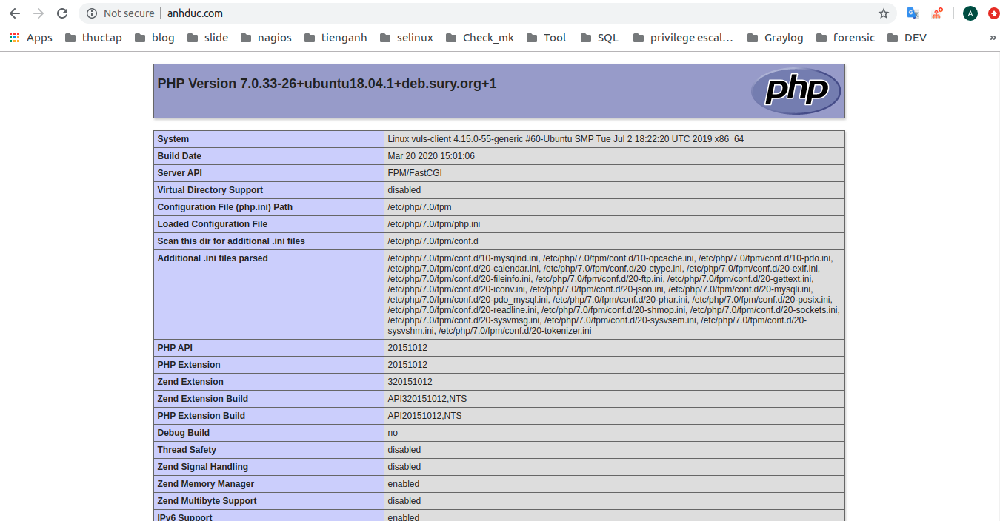
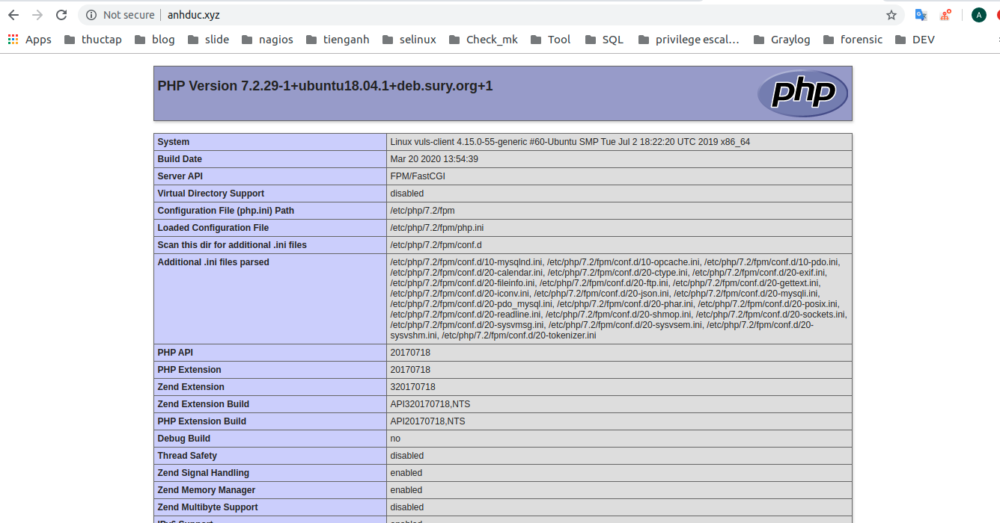

# Cài đặt chạy nhiều version PHP trên một server trên Ubuntu 18.04
## I. INTRO 
- `Apache web server` được sử dụng để quản lý nhiều `domain` trên một `instance`
- Tương tự như thế thì `PHP-FPM` được sử dụng để quản lý nhiều version PHP trên một `instance`
- Khi cùng sử dụng cả hai cùng một lúc và trên cùng một máy chủ để có thể lưu trữ nhiều ứng dụng PHP. 
- Điều này khá là có ích khi mà các ứng dụng khác nhau lại có yêu cầu về version PHP khác nhau. Ví dụ như LAMP 
- Đây là một giải pháp khá là tốt được sử dụng để lưu trữ nhiều version PHP và có hiệu năng tốt 

Kịch bản :
- Sử dụng 2 trang web PHP riêng và mỗi trang web sử dụng một domain riêng và 1 ip public riêng. Và mỗi một domain lại sử dụng một PHP version riêng biệt 
- Domain 1 : sử dụng PHP 7.0 
- Domain 2 : Sử dụng PHP 7.2

Chuẩn bị 
- Một máy ubuntu 18.04 với ít nhất 1G RAM 
- Cài đặt `Apache` . Một tên miền được cấu hình để trỏ đến server này
- Cài đặt hai site của của web server. 

## II. Thực hiện 
1. Cài đặt PHP 7.0 và PHP 7.2 với PHP-FPM 
- Cài đặt phần mềm `software-properties-common` 
- Gói này cung cấp thêm dòng lệnh `apt-add-repository`. Được sử dụng để thêm `ondrej/php`
```
sudo apt-get install software-properties-common -y
```
- Add repository `ondrej/php`. Nó có những phiên bản cập nhật của PHP mới nhất 
```
sudo add-apt-repository ppa:ondrej/php
```
- Cập nhật repository
```
sudo apt-get update -y
```
- Cài đặt PHP 7.0
```
sudo apt-get install php7.0 php7.0-fpm php7.0-mysql libapache2-mod-php7.0 libapache2-mod-fcgid -y
```
- Cài đặt PHP 7.2
```
sudo apt-get install php7.2 php7.2-fpm php7.2-mysql libapache2-mod-php7.2 -y
```
- Start PHP 7.0
```
sudo systemctl start php7.0-fpm
```
- Kiểm tra trạng thái PHP 7.0
```
sudo systemctl status php7.0-fpm
```
- Start PHP 7.2
```
sudo systemctl start php7.2-fpm
```
- Kiểm tra trạng thái PHP7.2
```
sudo systemctl status php7.2-fpm
```
- Kích hoạt module để có thể làm việc được với 2 phiên bản PHP 
```
sudo a2enmod actions fcgid alias proxy_fcgi
```
- Trong đó :
    - `actions` : Để thực thi các tập lệnh dựa trên kiểu media hoặc request method 
    - `fcgid` : Để xử lý nhiều chương trình CGI đồng thời 
    - `proxy_fcgi` : Cho phép các yêu cầu của Apache chuyển tiếp tới ` PHP-FPM.`
- Khởi động lại apache 
```
sudo systemctl restart apache2
```

2. Tạo cấu trúc thư mục cho cả 2 trang web
- Tạo ra thư mục chứa cho 2 trang web 
```
sudo mkdir /var/www/anhduc.com
sudo mkdir /var/www/anhduc.xyz 
```
- Tạo file `info` cho cả 2 site 
```
sudo vi /var/www/anhduc.com/info.php
```
- Nội dung 
```
<?php phpinfo(); ?>
```
- Copy cho site 2 
```
cp /var/www/anhduc.com/info.php /var/www/anhduc.xyz/info.php
```

3. Cấu hình site cho cả 2 web
- sửa file `vi /etc/apache2/sites-available/anhduc.com.conf`
```
<VirtualHost *:80>
    ServerAdmin webmaster@localhost
    ServerName anhduc.com
    ServerAlias www.anhduc.com
    DocumentRoot /var/www/anhduc.com
	
    DirectoryIndex info.php

     <Directory /var/www/anhduc.com>
        Options Indexes FollowSymLinks MultiViews
        AllowOverride All
        Order allow,deny
        allow from all
     </Directory>


    <FilesMatch \.php$>
      # For Apache version 2.4.10 and above, use SetHandler to run PHP as a fastCGI process server
      SetHandler "proxy:unix:/run/php/php7.0-fpm.sock|fcgi://localhost"
    </FilesMatch>

     ErrorLog ${APACHE_LOG_DIR}/anhduc_error.log
     CustomLog ${APACHE_LOG_DIR}/anhduc.com_access.log combined

</VirtualHost>

```
- Sửa file cho site 2 `/etc/apache2/sites-available/anhduc.xyz.conf` 
```
<VirtualHost *:80>
    ServerAdmin webmaster@localhost
    ServerName anhduc.xyz
    ServerAlias www.anhduc.xyz
    DocumentRoot /var/www/anhduc.xyz

    DirectoryIndex info.php

     <Directory /var/www/anhduc.xyz>
        Options Indexes FollowSymLinks MultiViews
        AllowOverride All
        Order allow,deny
        allow from all
     </Directory>    

    <FilesMatch \.php$>
      # For Apache version 2.4.10 and above, use SetHandler to run PHP as a fastCGI process server
      SetHandler "proxy:unix:/run/php/php7.2-fpm.sock|fcgi://localhost"
    </FilesMatch>

     ErrorLog ${APACHE_LOG_DIR}/anhduc.xyz_error.log
     CustomLog ${APACHE_LOG_DIR}/anhduc.xyz_access.log combined
</VirtualHost>
```
- Kiểm tra cấu hình apache 
```
sudo apachectl configtest
```
- Khởi động lại apache 
```
sudo systemctl restart apache2
```

4. Kiểm tra lại bằng cách đăng nhập hai domain 





