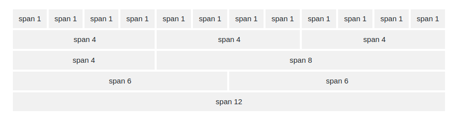

# Giới thiệu và cơ bản về bootstrap
1. Intro 
* `Bootstrap` là khung của HTML, CSS và JS phổ biến nhất cho việc phát triển web di động đầu tiên. 
* `Bootstrap` hoàn toàn miễn phí. Phiên bản mới nhất của nó hiện tại là `Bootstrap 4` 
*  Internet Explorer 9 trở xuống sẽ không được hỗ trợ `Bootstrap 4`. Nếu muốn sử dụng IE8 và IE9 thì hãy sử dụng `Bootstrap 3`
* Tương tự như `Bootstrap 4` thì có `W3.CSS` nhưng nó sẽ nhanh hơn và dễ sử dụng hơn [W3.CSS tutorial](https://www.w3schools.com/w3css/default.asp)
- Bootstrap là một công cụ sử dụng để làm front-end dễ dàng hơn.
- Bootstrap là các mẫu cho kiểu chữ, form, buttons, table,... cững như các plugin JS tùy chọn 
- Bootstrap cũng cung cấp cho bạn khả năng dễ dàng tạo ra các thiết kế đáp ứng được yêu cầu 
- Bootstrap là phiên bản mới nhất. Tốc độ của nó được cải thiện 
- Bootstrap dễ dàng sử dụng. Chỉ cần có kiến thức cơ bản về HTML và CSS là có thể sử dụng nó
- Các tính năng đáp ứng : CSS đáp ứng điểu chỉnh cho điện thoại máy tính 
- Trong bootstrap thì lõi của front-end điện thoại là mobile-first 
- Có hai cách để sử dụng `bootstrap`:
    - Download tại [getbootstrap.com](https://getbootstrap.com/)
    - Nếu như không muốn download thì có thể sử dụng CDN(Content Delivery Network)
- `Bootstrap 4` Sử dụng các `properties CSS` yêu cầu HTML 5
- Luôn sử dụng `HTML 5` bằng attribute `lang` ở đầu trang và loại ký tự xác định 
```html
<!DOCTYPE html>
<html lang="en">
  <head>
    <meta charset="utf-8">
  </head>
</html>
```
- `Bootstrap 4` được thiết kế đáp ứng cả cho các thiết bị di động. Để sử dụng đúng hiển thị hãy thêm thẻ `meta` vào bên trong `<head>`
```html
<meta name="viewport" content="width=device-width, initial-scale=1">
```

2. Container
- Khi làm giao diện thì cần có `element` để chứa nội dung trang web. Trong `Bootstrap 4` sử dụng `container` để chứa chúng. Có hai loại container được sử dụng 
    - `.container` : là class cung cấp một chiều dài cố định 
    - `.container-fluid` : Class cung cấp toàn bộ chiều dài của màn hình  
- Theo mặc định thì `padding` trong container là `15px` về bên trái và phải. Sẽ không có padding trên và dưới.  Nếu muốn sử dụng thêm thì ta sẽ phải sử dụng thêm class `pt-3` là `16px top`
```html
<div class="container pt-3">
  <h1>My First Bootstrap Page</h1>
  <p>This is some text.</p>
</div>
```
- Ở mỗi màn hình có độ rộng khác nhau thiof `max-width` của `.container` sẽ khác nhau

| Class |	Extra small <576px|(Small) ≥576px|(Medium) ≥768px|(Large) ≥992px |	(Extra large) ≥1200px |
|---|---|---|--- |---|---|
|.container-sm | 100% |	540px |	720px |	960px |	1140px |
|.container-md | 100% |	100% |	720px |	960px |	1140px |
|.container-lg | 100% |	100% |	100% |	960px |	1140px |
|.container-xl | 100% |	100% |	100% |	100% |	1140px |

3. Grid system 
- Trong `bootstrap 4` được xây dựng cho phép tối đa 12 `columns` trên một trang 



- Nếu không muốn sử dụng tất cả thì có thể nhóm chúng lại với nhau 
- Hệ thống sẽ tự `responsive` tùy thuộc vào kích thước màn hình 
- Giống như container sẽ có 5 class dành cho grid system 
    - .col- 
    - .col-sm- 
    - .col-md- 
    - .col-lg- 
    - .col-xl-
- Cú pháp cơ bản khi sử dụng grid 
```html 
<div class="row">
  <div class="col-*-*"></div>
  <div class="col-*-*"></div>
  <div class="col-*-*"></div>
</div>

<div class="row">
  <div class="col"></div>
  <div class="col"></div>
  <div class="col"></div>
</div>
```
- Sử dụng `col` là sẽ mặc định để bootstrap tự chia đều bố cục theo phần trăm màn hình 
- Còn `col-*-*` thì dấu `*` đầu tiên đại diện khả năng responsive của màn hình còn dấu `*` thứ 2 đại diện cho số cột tối đa 
- Ví dụ dưới đây về class `col-sm-3` có nghĩa là chúng sẽ tạo ra 4 cột bằng nhau. Có tỷ lệ màn hình trên `576px` nếu nhỏ hơn sẽ xảy ra `responsive` các cột trở thành `block`
```html
<div class="row">
  <div class="col-sm-3">.col-sm-3</div>
  <div class="col-sm-3">.col-sm-3</div>
  <div class="col-sm-3">.col-sm-3</div>
  <div class="col-sm-3">.col-sm-3</div>
</div>
```
4. Text 
- Theo mặc định trong `bootstrap 4` thì `font-size` là 16px còn `line-height` là 24px
- `font-family` : là "Helvetica Neue", Helvetica, Arial, sans-serif.
- Tất cả các thẻ `<p>` đều có `margin-top : 0` và `margin-bottom: 16px`
- Các tiêu đề cũng có chiều cao mặc định của nó 

| header | line-height |
| --- | --- |
| h1 | 40px |
| h2 | 32px |
| h3 | 28px |
| h4 | 24px |
| h5 | 20px |
| h6 | 16px |

- Các heading cũng có 4 loại được sử dụng : `.display-1`, `.display-2`, `.display-3`, `.display-4`
- Thẻ `<small>` là phần tử được sử dụng để tạo `element` nhỏ hơn
```html
<h6>h6 heading <small>secondary text</small></h6>
```
- Thẻ `<mark>` được sử dụng đê tạo ra phần tử có nền màu vàng 
```html
<p>Use the mark element to <mark>highlight</mark> text.</p>
```
- Thẻ `abbr` được sử dụng để tạo ra một đường kẻ dưới chấm 
```html
<p>The <abbr title="World Health Organization">WHO</abbr> was founded in 1948.</p>
```
- Thẻ `<code>` được sử dụng cho các dòng code 
```html
<p>The following HTML elements: <code>span</code>, <code>section</code>, and <code>div</code> defines a section in a document.</p>
```
- Một số class dành cho `style` của text 

| class | Description| 
| --- | --- |
| .text-left | văn bản căn lề trái | 
| .text-center | văn bản căn ở giữa | 
| .font-weight-bold | chữ in đậm |
| .font-italic	| chữ in nghiêng | 
| .lead	 | làm cho một đoạn văn bản nổi bật | 
| text-right | Văn bản căn lề phải | 

Tìm hiểu thềm các [style text tại web w3schools](https://www.w3schools.com/bootstrap4/bootstrap_typography.asp)

5. color 
- Có thể chỉnh sửa được màu sắc của chữ, các class có các màu chữ trong `bootstrap` là : text-muted, .text-primary, .text-success, .text-info, .text-warning, .text-danger, .text-secondary, .text-white, .text-dark, .text-body. Theo mặc định thì chữ là màu đen 
- Cũng có thể thêm độ mờ cho văn bản 
```html 
<p class="text-black-50">độ mờ là 50%</p>
```

- Các màu nền cũng có các class riêng biệt : `.bg-primary`, `.bg-success`, `.bg-info`, `.bg-warning`, `.bg-danger`, `.bg-secondary`, `.bg-dark` và `.bg-light.`
- Thường thì màu nền không đặt kèm theo màu của chữ nên phải đặt màu chữ riêng biệt 
```html 
<p class="bg-light text-dark">Light grey background color.</p>
```

6. Table 
- Thông thường trong `bootstrap 4` có class `.table` phần dải cách ngang 
- Còn class `.table-striped` được sử dụng để thêm phần màu giữa các ô chẵn lẻ 
```html
<table class="table table-striped">
    <thead>
      <tr>
        <th>Firstname</th>
        <th>Lastname</th>
        <th>Email</th>
      </tr>
    </thead>
    <tbody>
      <tr>
        <td>John</td>
        <td>Doe</td>
        <td>john@example.com</td>
      </tr>
    </tbody>
  </table>
```
- ta có thể kết hợp các class với nhau 

| class | Description| 
| --- | --- |
| `.table-hover` | sẽ có hiệu ứng di chuột tới sẽ có màu xám |
| `.table-bodered` | sẽ có đường viền bo 1px quanh các ô  |
| `.table-dark` | màu nền của bảng là màu đen |
| `.table-borderless` | Xóa các đường viền khỏi bảng | 
| `.thead-dark` | Thêm màu nền đen cho tiêu đề bảng | 
| `.thead-light` | Thêm màu nền xám cho bảng  | 
| `.table-sm` | Thu nhỏ padding của mỗi ô | 
| `.table-responsive` | Sự biến đổi của bảng phụ thuộc vào màn hình |

- Ta có thể sử dụng được thêm màu cho toàn bộ bảng. Có thể tô theo màu ô hoặc là hàng 
```html
<tr class="table-primary">
  <td>Primary</td>
  <td>Joe</td>
  <td>joe@example.com</td>
</tr>
```

| class | Description| 
| --- | --- |
|.table-primary	| Nền màu xanh dương |
|.table-success	| Nền màu xanh lá |
|.table-danger | Nền màu đỏ |
|.table-info	| Nền màu xanh nhạt |
|.table-warning | Nền màu cam   |
|.table-light | Nền màu xám nhạt |
|.table-dark | Nền màu xám tối |
| .table-active | Nền mày xám | 

7. Images 
- Thêm một góc tròn nhỏ cho hình ảnh `.rounded`
```html

```
- Định hình ảnh tạo thành một vòng trong `.rounded-circle` 

```html

```
- Tạo ra đường viền cho hình ảnh `.img-thumbnail` 

```html

```

- Hình ảnh được sát phải hoặc trái `.float-right` và `.float-left` 

```html


```

- Hình ảnh được thêm vào giữa 
```html 

```

- Chia tỷ lệ hình ảnh theo  `element` chứa nó sử dụng `.img-fluid` 
```html

```
