# Hướng dẫn tạo cảnh báo qua slack trên graylog server
## I. Mô hình 

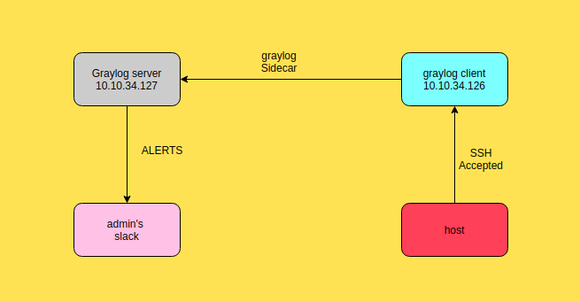

1. Chuẩn bị

| Hostname | IP | CPU | RAM | DISK|
|--|---|--|---|---|
| graylogsv | 10.10.34.127 | 1 | 1G | 20G |
| client | 10.10.34.126 | 1 | 4G | 50G |
| host | 10.10.34.1 | 4 | 4G | 320G | 

2. Yêu cầu 
* Trên `graylogsv` : Cài đặt service `graylog-server`. 
* Trên `client` : Cài đặt graylog-sidecar. Rồi gửi log của ssh lên `graylog-server` với thư mục `cat /var/log/secure` 
* Trên `Web-interface` của `graylog-server`: Sử dụng groktoken bản tin ssh. 

3. Kịch bản 
* Cài đặt gửi log của ssh của máy `client` lên `graylog-server` 
* Sử dụng `groktoken` cho bản tin ssh 

**Hai phần trên đã được làm trong những bài trước**

* Cài đặt kênh `slack` để cảnh báo tới 
* Cài đặt `alerts` cảnh báo đến `slack` khi có đăng nhập đúng 
* Dùng `host` ssh tới `client` để kiểm tra cảnh báo 

## Thực hiện 
1. Cài đặt slack 

Hãy đọc hướng dẫn sau để  [Tạo kênh URL slack](https://docs.google.com/document/d/1VpkJU_Ebd8x3mvEKHjm_A062sX8AUYX0UTqNljS5vwg/edit)

* Lưu ý: Khi tạo `URL slack` ta cài đặt `webhook` sẽ có hai loại `webhook`. Một loại được sử dụng để gửi bản tin đến slack và một loại được sử dụng để gửi bản tin từ slack đi. 

Sau khi tạo xong URL của `webhook` trên slack thì hãy lưu URL của nó về cần sử dụng đến

2. Download plugin của slack cho graylog-server
* Plugin của slack được download [tại đây](https://github.com/graylog-labs/graylog-plugin-slack/releases/tag/3.1.0). Ta sẽ download đuôi `.jar` về thư mục chứa các plugin của graylog-server
```
cd
cd /usr/share/graylog-server/plugin/
wget https://github.com/graylog-labs/graylog-plugin-slack/releases/download/3.1.0/graylog-plugin-slack-3.1.0.jar
```
Kiểm tra các gói download về 
```
[root@graylogsv plugin]# ls
graylog-plugin-aws-3.1.4.jar        graylog-plugin-threatintel-3.1.4.jar
graylog-plugin-collector-3.1.4.jar  telegram-alert-2.2.0.jar
graylog-plugin-slack-3.1.0.jar
```
Khởi động lại dịch vụ 
```
systemctl restart graylog-server
```

3. Cài đặt alerts trên web-interface 
* Ta thực hiện vào chọn các bước như dưới đây 

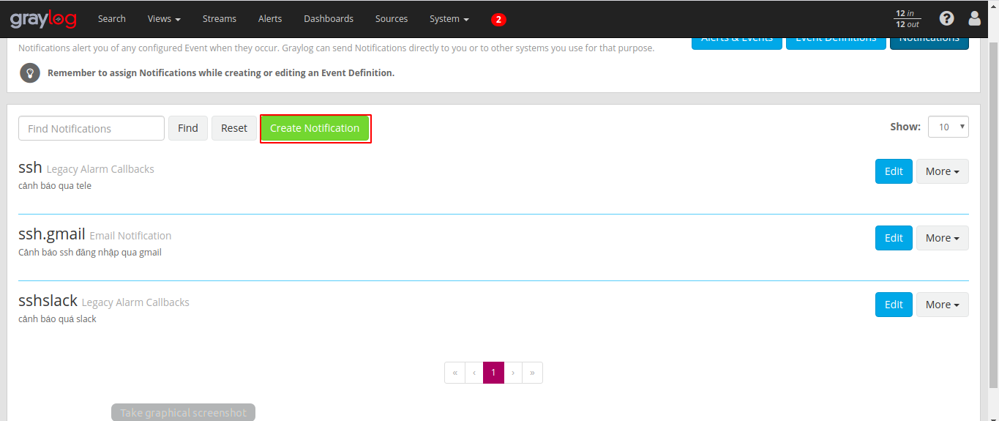

Ta vào `Alerts` xong rồi tạo mới một `Notifications`

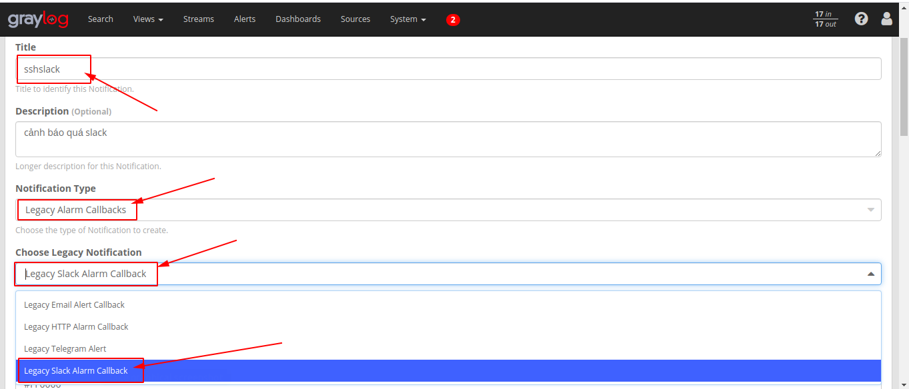

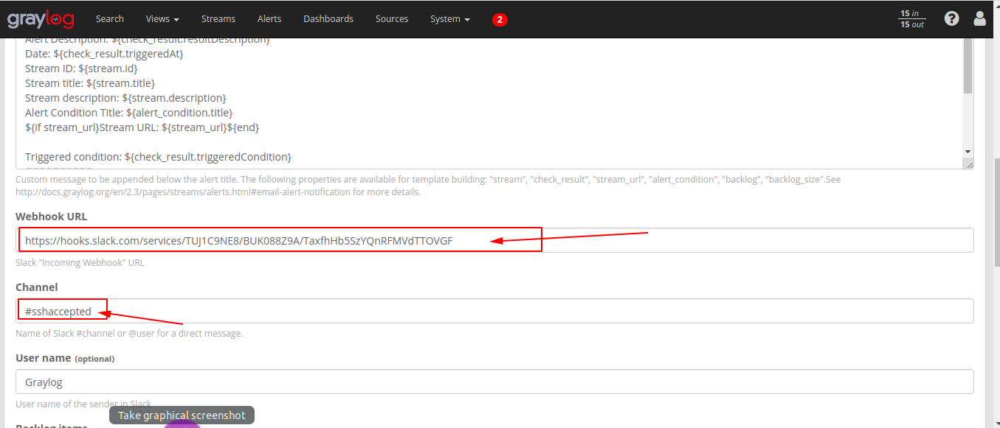

* Ta hãy sử dụng kênh URL mà đã tạo ở bước đầu tiên để điền vào 
* Và `channel` chính là kênh mà ta sẽ gửi đến trong của ta tạo ra. hoặc cũng có thể sử dụng gửi đến cho một người dùng bằng cách dùng `@username`

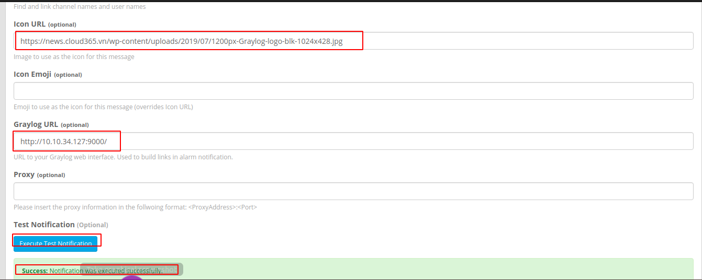

* Icon URl : chính là link ảnh hiển thị để gửi tin nhắn cảnh báo 
* Graylog URL: là địa chỉ của web graylog server
* sau đó ta task gửi đến slack. Và hiện dòng cuối là có thể gửi được cảnh báo đến slack. Tiếp theo là tạo ra mức cảnh báo cho thông báo này 

4. Tạo ngưỡng cảnh báo 

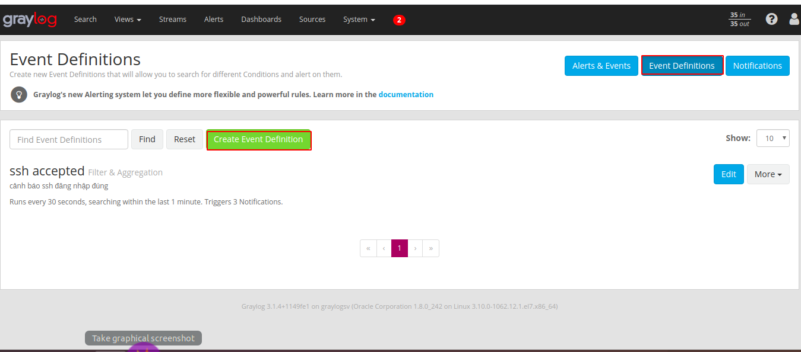

Ta vào `Event definitions` và tạo mới nó 

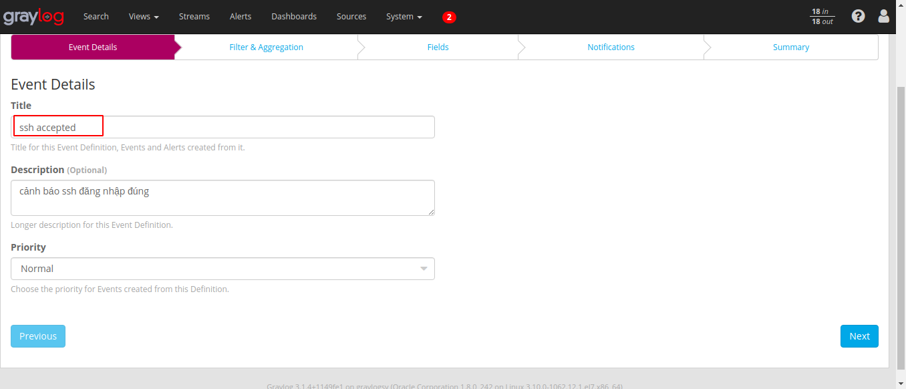

* đầu tiên là ta ghi tên miêu tả rõ ràng và mức độ ưu tiên cảnh báo sau rồi ta ấn `next`

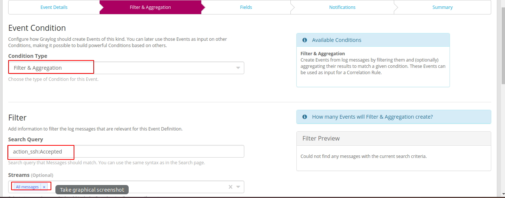 

Ta lọc theo hành động của nó xảy ra là đăng nhập thành công. Và dựa vào `stream` mà có tất cả tin nhắn là `all mesagess`hoặc có thể tạo ra một `stream` riêng biệt 

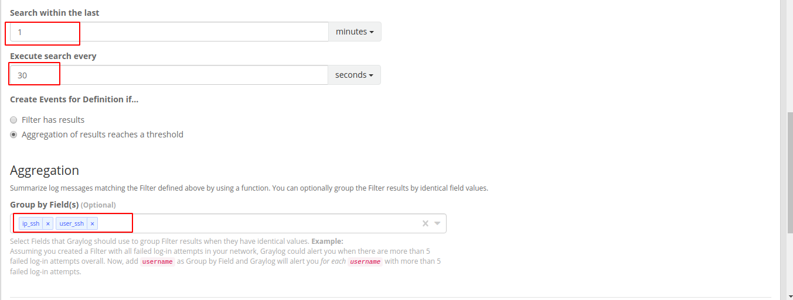 

Ta sẽ kiểm tra nó trong vòng tổng 1 phút và 30s kiểm tra 1 lần 

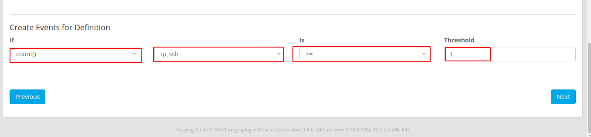 

Nếu tổng 2 lần kiểm tra trong vòng 1 phút. phát hiện ra số lần đăng nhập của 1 IP lớn hơn hoặc bằng 1 thì sẽ phát ra cảnh báo. Có nghĩa là cứ có đăng nhập thành công là có thông báo và ấn next 

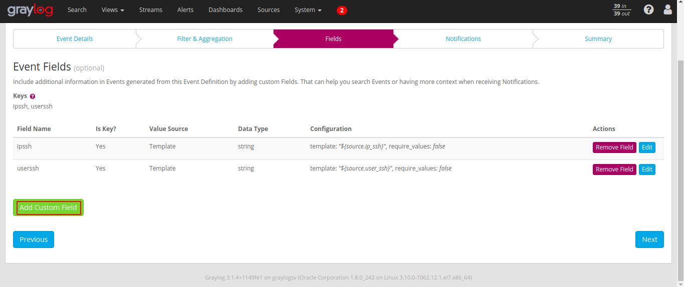 

Chọn ra dữ liệu được gửi đi cùng với lời cảnh báo 

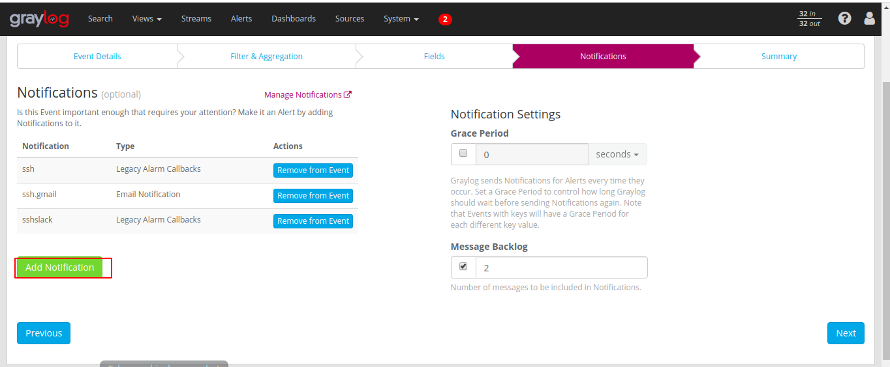 

Khi sự kiện này xảy ra thì cảnh báo đến ai ta sẽ add vào người đó. Như bài này ta sẽ add cái gửi cảnh báo đế `slack` đã tạo bên trên 

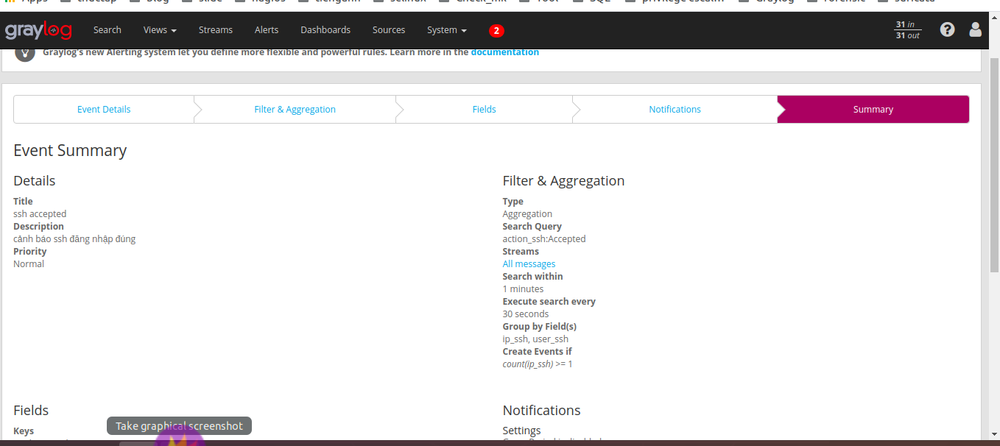 

Kiểm tra lại tổng quan và ấn hoàn thành 

5. Kiểm tra bộ lọc và thông báo ta tạo ra 
* SSH tới client
```
anhduc@anhduc:~$ ssh root@10.10.34.126
root@10.10.34.126's password: 
Last login: Thu Feb 27 16:07:59 2020 from gateway
[root@suricata ~]#
```
* Kiểm tra trên web graylog server 

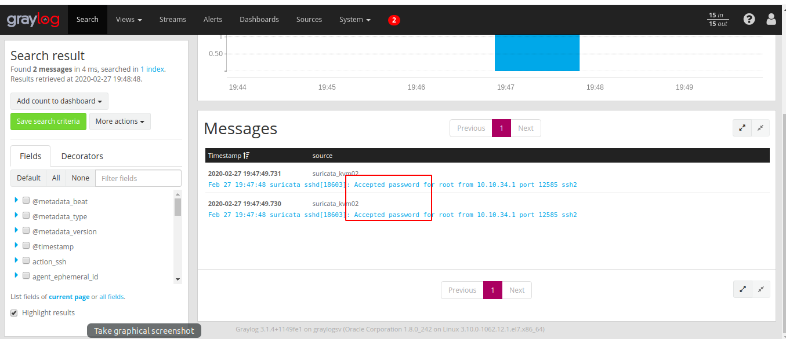 

* Kiểm tra thông báo trên slack 

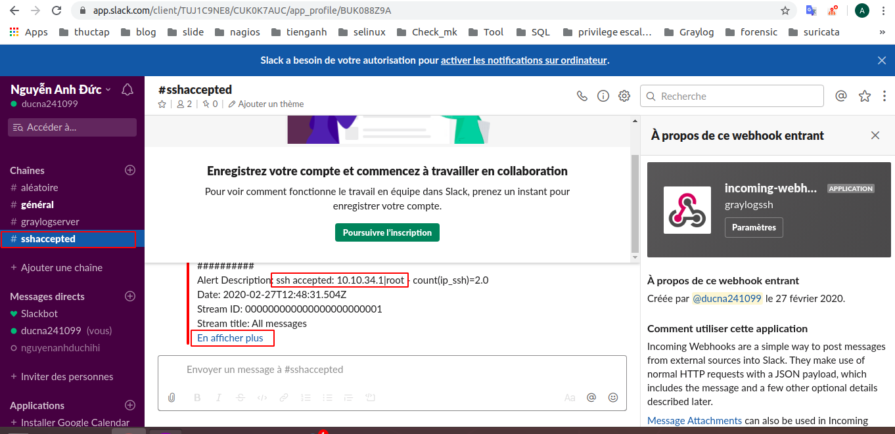 

Đã có cảnh báo tới slack và đúng kênh ta chọn ở trên. Ta có thể đọc thêm thông tin ở dòng chữ xanh bên dưới 