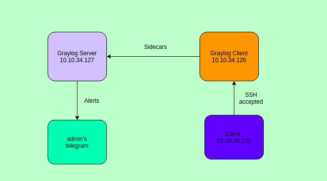
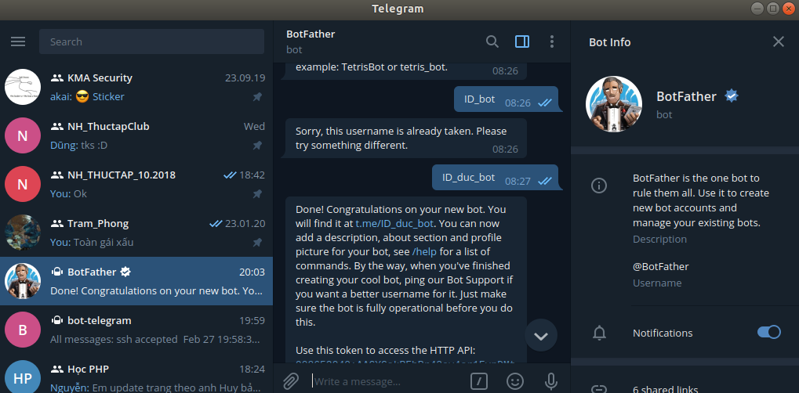
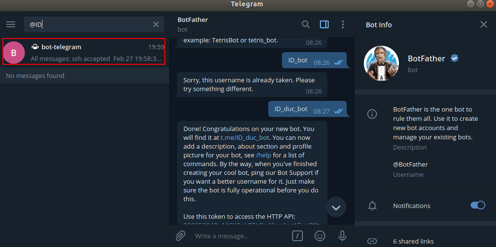
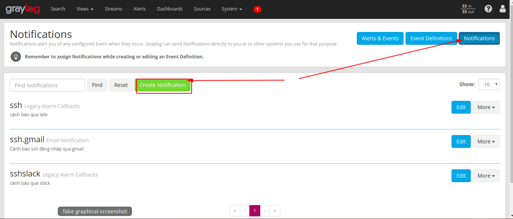
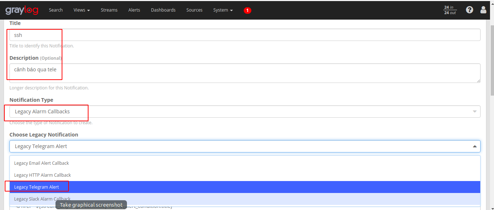
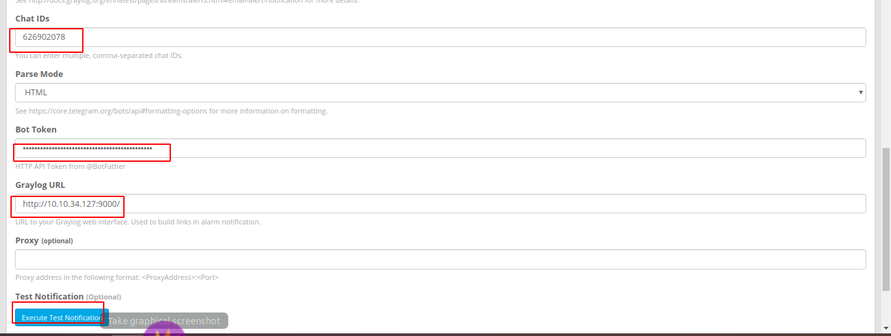
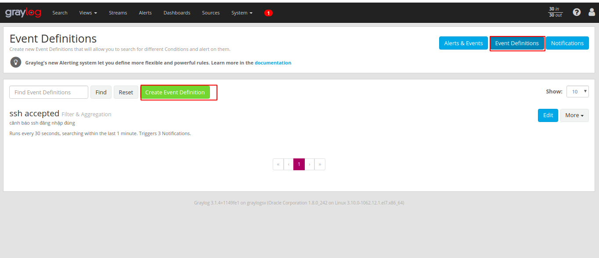
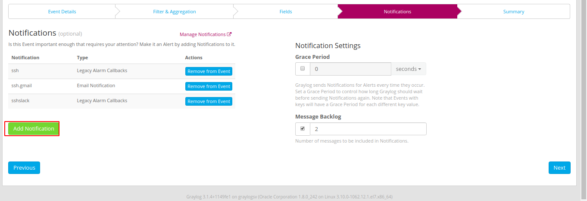
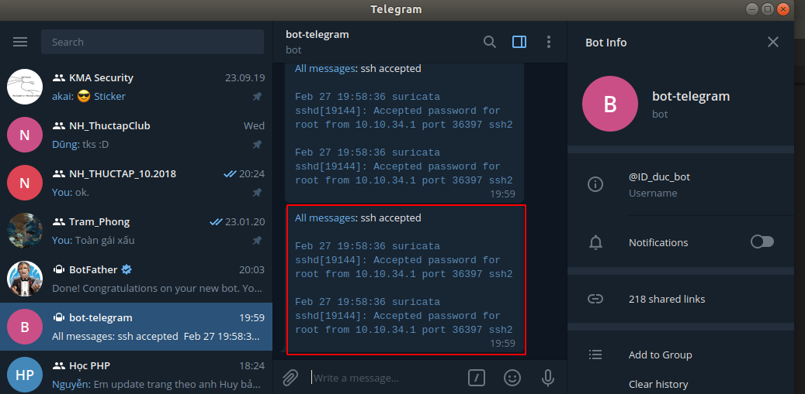

# Hướng dẫn tạo cảnh báo qua telegram trên graylog server
## I Mô hình



1. Chuẩn bị 

| Hostname | IP | CPU | RAM | DISK|
|--|---|--|---|---|
| graylogsv | 10.10.34.127 | 1 | 1G | 20G |
| client | 10.10.34.126 | 1 | 4G | 50G |
| host | 10.10.34.1 | 4 | 4G | 320G | 

2. Yêu cầu 
* Trên `graylogsv` : Cài đặt service `graylog-server`. 
* Trên `client` : Cài đặt graylog-sidecar. Rồi gửi log của ssh lên `graylog-server` với thư mục `cat /var/log/secure` 
* Trên `Web-interface` của `graylog-server`: Sử dụng groktoken bản tin ssh. 

3. Kịch bản 
* Giống như với cảnh báo cho `slack` nhưng mà ta sẽ chuyển sang gửi cảnh báo cho telegram 

## II Thực hiện 
1.  Lấy và tạo bot trên tele 

Nếu như sử dụng cảnh báo qua telegram ta sẽ làm theo [bài này](https://github.com/duckmak14/thuctapsinh/blob/master/DucNA/check_mk/docs/6.2.Canh-bao-tele.md)




Sau khi có tên và token ta sử dụng token để lấy ID chat như bài trên. Và sử dụng tên để tìm kiếm bot theo tên 



Nó sẽ hiển thị ra `bot telegram` mà bạn đã tạo ra 

2. Thực hiện trên web interface 

Ta sẽ thực hiện theo các bước dưới đây 







Nếu kiểm tra gửi tin nhắn tới bot thành công thì chứng tỏ có thể sử dụng cảnh báo này để làm cảnh báo cho một sự kiện nào đó xảy ra 

3. Tạo ra sự kiện để cảnh báo 



Ta có thể tạo cái mới hoặc là sử dụng sự kiện đã tạo cho slack 



chỉ cần add liên hệ nào, cảnh báo nào được sử dụng khi sự kiện này xảy ra là được 

3. Kiểm tra 
* SSH tới client 
```
anhduc@anhduc:~$ ssh root@10.10.34.126
root@10.10.34.126's password: 
Last login: Thu Feb 27 16:07:59 2020 from gateway
[root@suricata ~]#
```

Kết quả 



Thông tin đã được gửi về telegram 