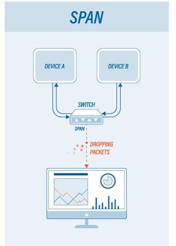
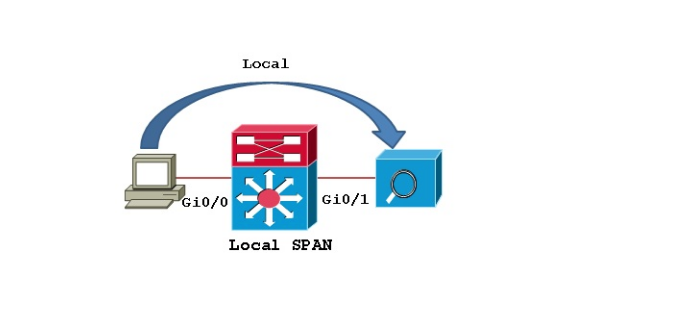
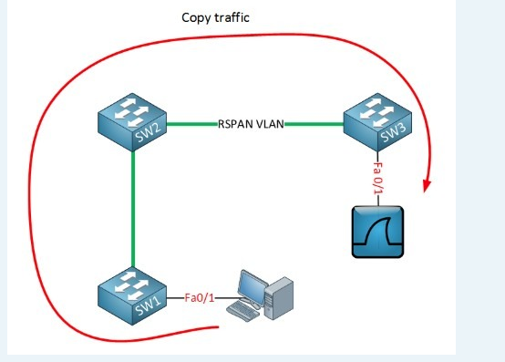
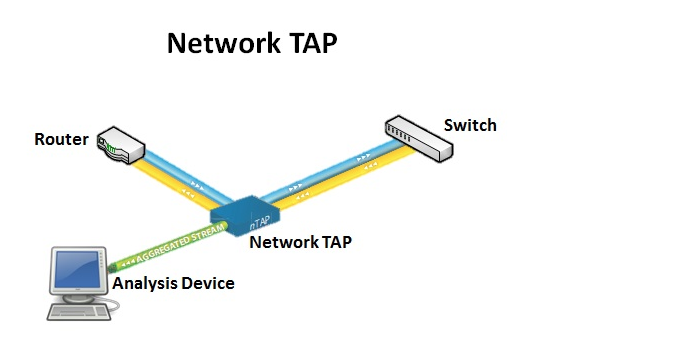

# Tìm hiểu một số khái niệm 
## 1. Spanport
SPAN(Switched Port Analyzer) : hay còn được gọi với cái tên là port mirror là một phương pháp được sử dụng để giám sát lưu lượng mạng. Khi mà bật chức năng này lên thì bộ chuyển mạch sẽ gửi một bản sao của tất cả các gói mạng về port mirror(nơi mà các gói tin có thể được phân tích)

- Các phiên của port mirror không ảnh hưởng đến hoạt động bình thường của switch 
- có thể cấu hình được từ xa từ hệ thống nào có kết nối tới switch 

Phân loại Span 
- Local span: Là sơ đồ hoạt động mà trong đó `port mirror` và các port được giám sát hoạt động trên cùng một switch 

- Remote SPAN: là một hoạt động mở rộng của span. Nó cho phép giám sát các port của một thiết bị switch khác trong hệ thống. `RSPAN` hoạt động bằng cách gửi các bản copy thông qua các đường trunk giữa các kết nối switch 

## 2. TAP 
TAP (Test Access Point) : Là một điểm được sử dụng để quản lý và giám sát lưu lượng mạng của hai thiết bị đầu cuối. Các `TAP` thường được sử dụng trong mô hình `Network IDS`. Sẽ có một thiết bị được gắn giữa 2 điểm và bản copy của lưu lượng được gửi đến nơi giám sát mà không làm gián đoạn và không cần thông báo trước. Không có địa chỉ IP không có địa chỉ MAC 

Sự khác biệt chủ yếu giữa `SPAN` và `TAP` là khi sử dụng `TAP` thì tất cả các gói tin đều được bắt và gửi đến nơi phân tích dữ liệu mà không hề có gói tin nào bị drop. Còn khi sử dụng `SPAN` thì các gói tin sẽ có thể bị drop. Nó phù hợp với việc sử dụng khi phân tích dữ liệu mất một vài gói tin không bị ảnh hưởng và liên quan đến chi phí thì sẽ sử dụng `SPAN`. 

# Tài liệu tham khảo 

https://www.forescout.com/company/resources/configuring-cisco-span/

https://community.cisco.com/t5/networking-documents/understanding-span-rspan-and-erspan/ta-p/3144951

https://community.cisco.com/t5/networking-documents/understanding-span-rspan-and-erspan/ta-p/3144951

https://www.cisco.com/c/en/us/td/docs/switches/lan/catalyst3750x_3560x/software/release/12-2_55_se/configuration/guide/3750xscg/swspan.html#70086
