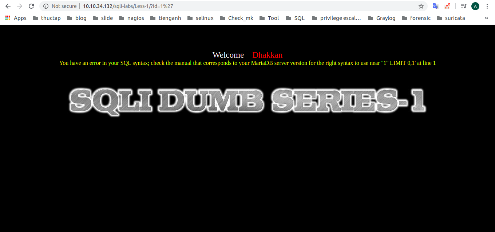

# Một số rule trong snort 
## I. Rule của gói tin icmp
1. tạo ra rule icmp để kiểm tra xem hoạt động của snort phát hiện

```
vi /etc/snort/rules/local.rules
```

Thêm nội dung sau 
```
alert icmp any any -> $HOME_NET any (msg:"ICMP test"; sid:10000001; rev:001;)
```

2. kịch bản kiểm tra bằng cách chạy lệnh máy này và dùng máy khác ping đến

3. Host 1
```
[root@client01 ~]# snort -A console -q -u snort -g snort -c /etc/snort/snort.conf
02/06-17:39:41.344515  [**] [1:10000001:1] ICMP test [**] [Priority: 0] {ICMP} 10.10.34.122 -> 10.10.34.132
02/06-17:39:41.344559  [**] [1:10000001:1] ICMP test [**] [Priority: 0] {ICMP} 10.10.34.132 -> 10.10.34.122
02/06-17:39:42.345523  [**] [1:10000001:1] ICMP test [**] [Priority: 0] {ICMP} 10.10.34.122 -> 10.10.34.132
02/06-17:39:42.345559  [**] [1:10000001:1] ICMP test [**] [Priority: 0] {ICMP} 10.10.34.132 -> 10.10.34.122
02/06-17:39:43.346506  [**] [1:10000001:1] ICMP test [**] [Priority: 0] {ICMP} 10.10.34.122 -> 10.10.34.132
02/06-17:39:43.346543  [**] [1:10000001:1] ICMP test [**] [Priority: 0] {ICMP} 10.10.34.132 -> 10.10.34.122
```


4. host 2
```
[root@snort snort_src]# ping 10.10.34.132
PING 10.10.34.132 (10.10.34.132) 56(84) bytes of data.
64 bytes from 10.10.34.132: icmp_seq=1 ttl=64 time=0.572 ms
64 bytes from 10.10.34.132: icmp_seq=2 ttl=64 time=0.509 ms
64 bytes from 10.10.34.132: icmp_seq=3 ttl=64 time=0.792 ms
64 bytes from 10.10.34.132: icmp_seq=4 ttl=64 time=0.772 ms
64 bytes from 10.10.34.132: icmp_seq=5 ttl=64 time=0.692 ms
```

## II. Snort rules với sqli 
1. Download và cài đặt sqli lab 

cài đặt bài lab sql để thử xem snort có phát hiện ra được tấn công sqli không. [làm theo bài hướng dẫn này để cài đặt](https://github.com/niemdinhtrong/thuctapsinh/blob/master/NiemDT/Security/docs/install-sqli-labs.md)


2. Cài đặt httpd để sử dụng web 
```
yum install httpd -y
```
khởi động httpd
```
systemctl start httpd 
systemctl enable httpd 
```

3. Mở port firewalld cho httpd 
```
sudo firewall-cmd --permanent --add-port=80/tcp
sudo firewall-cmd --permanent --add-port=443/tcp
sudo firewall-cmd --reload
```
4. Viết rule cho phát hiện sqli 
```
alert tcp any any -> $HOME_NET 80 (msg:"Detect attack SQL injection"; classtype:web-application-attack; content:"%27"; http_header; sid:1000002; rev:001;)
alert tcp any any -> $HOME_NET 80 (msg:"Detect attack SQL injection"; classtype:web-application-attack; content:"%22"; sid:1000003; rev:001;)

alert tcp any any -> $HOME_NET 80 (msg:"Detect attack SQL injection"; classtype:web-application-attack; content:"union"; sid:1000004; rev:001;)
alert tcp any any -> $HOME_NET 80 (msg:"Detect attack SQL injection"; classtype:web-application-attack; content:"--"; sid:1000005; rev:001;)
alert tcp any any -> $HOME_NET 80 (msg:"Detect attack SQL injection"; classtype:web-application-attack; content:"*%20*=%20*'*"; sid:1000006; rev:001;)
alert tcp any any -> any 80 (msg: "Error Based SQL Injection Detected"; content: "%27" ; sid:100000011; )
alert tcp any any -> any 80 (msg: "Error Based SQL Injection Detected"; content: "22" ; sid:100000012; )
```

5. Kiểm tra lại bằng cách chạy command và sqli web
```
[root@client01 ~]# sudo snort -A console -q -u snort -g snort -c /etc/snort/snort.conf -i eth0
02/06-18:03:23.823966  [**] [1:100000012:0] Error Based SQL Injection Detected [**] [Priority: 0] {TCP} 10.10.34.1:59057 -> 10.10.34.132:80
02/06-18:03:23.883733  [**] [1:100000012:0] Error Based SQL Injection Detected [**] [Priority: 0] {TCP} 10.10.34.1:59057 -> 10.10.34.132:80
02/06-18:03:23.891840  [**] [1:100000012:0] Error Based SQL Injection Detected [**] [Priority: 0] {TCP} 10.10.34.1:62866 -> 10.10.34.132:80
02/06-18:03:26.915645  [**] [1:100000012:0] Error Based SQL Injection Detected [**] [Priority: 0] {TCP} 10.10.34.1:62866 -> 10.10.34.132:80
02/06-18:03:37.531085  [**] [1:100000011:0] Error Based SQL Injection Detected [**] [Priority: 0] {TCP} 10.10.34.1:58970 -> 10.10.34.132:80

```



## III. Scan port 
1. Rules snort 
```
alert tcp any any -> 10.10.34.132 any (msg: "NMAP TCP Scan"; sid:10000007; rev:001;)
```

2. Kiểm tra 
host
```
[root@client01 ~]# sudo snort -A console -q -u snort -g snort -c /etc/snort/snort.conf -i eth0
02/06-19:01:38.568649  [**] [1:10000007:1] NMAP TCP Scan [**] [Priority: 0] {TCP} 10.10.34.1:14178 -> 10.10.34.132:22
02/06-19:01:39.676814  [**] [1:10000007:1] NMAP TCP Scan [**] [Priority: 0] {TCP} 10.10.34.1:14178 -> 10.10.34.132:22
02/06-19:01:40.700895  [**] [1:10000007:1] NMAP TCP Scan [**] [Priority: 0] {TCP} 10.10.34.1:14178 -> 10.10.34.132:22
02/06-19:01:41.724743  [**] [1:10000007:1] NMAP TCP Scan [**] [Priority: 0] {TCP} 10.10.34.1:14178 -> 10.10.34.132:22
02/06-19:01:42.648652  [**] [1:10000007:1] NMAP TCP Scan [**] [Priority: 0] {TCP} 10.10.34.1:14178 -> 10.10.34.132:22
```

Client 
```
[root@snort snort_src]# nmap -sT -p22 10.10.34.132

Starting Nmap 6.40 ( http://nmap.org ) at 2020-02-06 19:00 +07
Nmap scan report for 10.10.34.132
Host is up (0.00073s latency).
PORT   STATE SERVICE
22/tcp open  ssh
MAC Address: 52:54:00:4E:E3:1E (QEMU Virtual NIC)

Nmap done: 1 IP address (1 host up) scanned in 0.11 seconds
```
