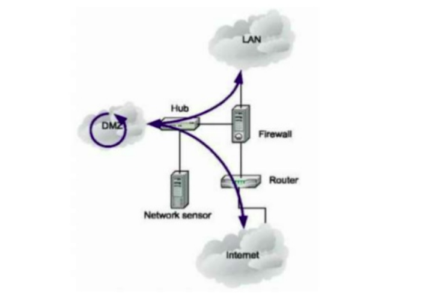

# Cài đặt port mirror trên centos7

## 1. Mô hình 



IPPLANNING

| host name | IP | RAM | DISK | OS | 
|---|---|---|---|---|
| hostkvm | 192.168.122.116 | 3G | 20G | centos 7| 
| mirror | 192.168.122.117 | 1G | 10G | centos 7 |
| client | 192.168.122.194 | 0.5G | 5G | centos 7|

Kịch bản: 
cài đặt kvm lên hostkvm xong rồi cài đặt linux bridge. Sau đó tạo 2 VM. Một VM làm monitor (mirror) và một VM làm client (client). Đứng từ hostkvm ping client. Đứng từ mirror bắt gói tin kiểm tra xem bản sao có được gửi về port mirror không

# Thực hiện.

Lệnh được thực hiện trên hostkvm 

## Cấu hình mirror traffic incoming trên interface

```
tc qdisc add dev vnet1 ingress

tc filter add dev vnet1 parent ffff: \
    protocol all \
    u32 match u8 0 0 \
    action mirred egress mirror dev vnet0
```

## Cấu hình mirror trafic outgoing trên interface

```
tc qdisc add dev vnet1 handle 1: root prio

tc filter add dev vnet1 parent 1: \
    protocol all \
    u32 match u8 0 0 \
    action mirred egress mirror dev vnet0
```

## Thực hiện up interface vnet0 
```
ip link set vnet0 up
```

Kiểm tra lại 

Trên Mirror
```
tcpdump -i vnet0 icmp
```
```
[root@hostkvm ~]# tcpdump -i vnet0 icmp
tcpdump: verbose output suppressed, use -v or -vv for full protocol decode
listening on vnet0, link-type EN10MB (Ethernet), capture size 262144 bytes
01:22:36.368579 IP hostkvm > 192.168.122.194: ICMP echo request, id 2695, seq 1, length 64
01:22:36.369169 IP 192.168.122.194 > hostkvm: ICMP echo reply, id 2695, seq 1, length 64
01:22:37.368559 IP hostkvm > 192.168.122.194: ICMP echo request, id 2695, seq 2, length 64
01:22:37.368938 IP 192.168.122.194 > hostkvm: ICMP echo reply, id 2695, seq 2, length 64
01:22:38.368506 IP hostkvm > 192.168.122.194: ICMP echo request, id 2695, seq 3, length 64
01:22:38.368962 IP 192.168.122.194 > hostkvm: ICMP echo reply, id 2695, seq 3, length 64
01:22:39.368697 IP hostkvm > 192.168.122.194: ICMP echo request, id 2695, seq 4, length 64

```

Trên hostkvm
```
ping 192.168.122.194
```
```
[root@hostkvm ~]# ping 192.168.122.194
PING 192.168.122.194 (192.168.122.194) 56(84) bytes of data.
64 bytes from 192.168.122.194: icmp_seq=1 ttl=64 time=0.710 ms
64 bytes from 192.168.122.194: icmp_seq=2 ttl=64 time=0.452 ms
```

