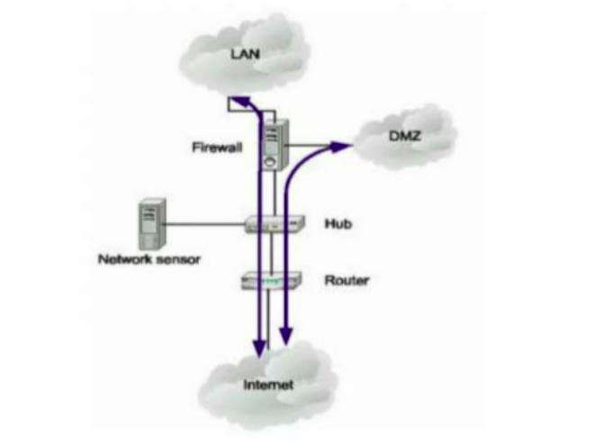
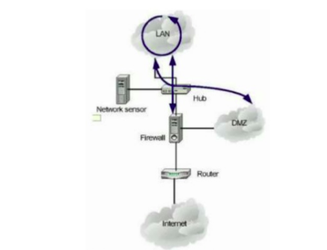
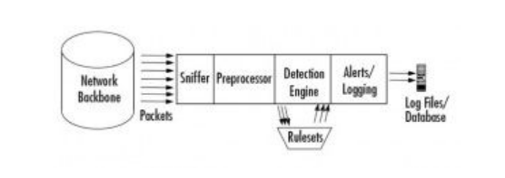

# Tìm hiểu về snort 
## I. Khái niệm 
* Snort là một giải pháp phát hiện xâm nhập mạng (NIDS). Nó khá là phổ biến và là phần mềm giám sát lưu lượng mạng trong thời gian thực. 
* Snort được phát triển bởi martin Roesch vào năm 1998 là phần mềm mà nguồn mở và hoàn toàn miễn phí 
* Một số chức năng của snort: Snort có thể nghe và lưu lại các thông tin gói tin hoặc phát hiện ra xâm nhập mạng. Bên cạnh đó có rất nhiều plugin để quản lý các dữ liệu trong snort
* Thông thường snort chỉ nói chuyện với TCP/IP (do đây là giao thức chủ yếu trên mạng internet) mặc dù với các thành phần tùy chỉnh mở rộng, Snort có thể thực hiện để hỗ trợ các giao thức mạng khác. 
* Phiên bản stable hiện tại là 2.9.15. Sự khác biệt giữa version 1.x và version 2.x là ở phiên bản 1.x khi so sánh các rule khi nó khớp với rule nào đó nó sẽ bỏ qua các rule ở đằng sau dù mức độ cảnh báo của nó cao hơn. Ở phiên bản 2.x thì gói tin sẽ được so sánh với tất cả các rule và cảnh báo với rule có mức độ cao nhất

## II. Các khái niệm trong snort 
1. Các chế độ hoạt động trong snort 

Trong snort có 3 chế độ thực thi trong snort 
* Packet Sniffer(sniffer mode): Ở chế độ này snort hoạt động như một chương trình thu thập và phân tích gói tin thông thường, lắng nghe các gói tin sau đó giải mã và hiển thị chúng lên màn hình. Ở chế độ này không cần sử dụng file cấu hình các thông tin của snort sẽ thu được khi hoạt động ở chế độ này như dưới đây: 
    * Date time 
    * source port (IP address)
    * Destubatuiin port (IP address)
    * Packet ID....

* Packet loggger mode 
    * Khi chạy ở mode này thì snort sẽ tập hợp tất cả các packet nó thấy được và đưa vào log theo cấu trúc phân tầng. Một thư mục mới sẽ được tạo ra ứng với mỗi địa chỉ mà nó bắt được. Dữ liệu phụ thuộc vào mà địa chỉ nó lưu trong thư mục. Snort sẽ đặt các packet vài trong file ASCII với tên liên quan đến giao thức và cổng. 
    * Snort có thể đọc được tất cả các log ở dạng nhị phân. Điều này giúp snort tăng khả năng bắt gói tin của snort. Hầy hết các hệ thống snort đều có thể bắt gói tin ở tốc độ 100Mbps mà không có vấn đề gì 

* NIDS mode 
    * Snort thường được biết đến như là một NIDS. Nó có mức độ hiệu quả và sử dụng các rule để áp dụng lên các gói tin. Khi có phát hiện tấn công ở các gói tin thì nó sẽ ghi lại và tạo cảnh báo đến người quản trị. Khi sử dụng ở chế độ này thì phải khai báo file cấu hình cho snort hoạt dộng. 
    * Một số thông tin cần khai báo ở chế độ này 
        * Fast mode: Date time, Alert messeage, Source IP, Destination IP, Source port, Destination port, type packet 
        * Full mode: khai báo toàn bộ thông tin trong cấu hình có

* Inline mode 
    * Đây là một chế độ hoạt động mới được sử dụng làm IPS. Là sự kết hợp giữa Snort và firewall để ngăn chặn lại các cuộc tấn công đến máy chủ 

2. Cấu trúc Rules 
* Một trong những chức năng của snort là cho phép người sử dụng tự viết lên các rule dành riêng cho hệ thống của mình. Ngoài các lượng rule đã được pulic bên ngoài internet thì người quản trị có thể tự viết những rule dựa trên khả năng của bản thân mình 
* Rule trong snort được chia làm hai phần : Rule header và Rule options 
* Các hành động mà rule có thể thực hiện được là:
    * Pass : hành động này làm cho snort bỏ qua các gói tin 
    * Log : Snort ghi lại nhất ký các gói tin 
    * Alert : Snort sẽ tạo ra cảnh báo xâm nhập đến cho người quản trị 

2.1 Rule header 
* Chứa các thông tin để xác định một packet cũng như tất cả những gì cần thực hiện với tất cả thuộc tính chỉ định trong rule. Rule header bao gồm các phần như sau: 

    * Rule action : Là hành động mà snort phải làm sau khi biết có gói tin phù hợp với một rule: cảnh báo, ghi lại log, bỏ qua packet 
    *  `Protocols` : Trong snort giao thức TCP, UDP, ICMP, IP...
    * `IP address` : các địa chỉ IP được hình thành dưới dạng thập phân. Snort không cung cấp cách tra cứ tên host theo địa chỉ IP 
    * `Port number` : Là số port của giao thức được sử dụng. Có thể được xác định tên hoặc là any (bất kỳ port nào)
    * `Direction Operator` : còn được gọi là hướng đi của rule, có hai loại. 1 là hướng đi của rule từ địa chỉ IP và port. 2 là bắt nguồn từ hai chiều. 

2.2 Rule options  
* Có tổng cộng 4 loại rule options chính: General, Payload, Non Payload, Post detection  
    * `General options` :  Cung cấp thông tin về rule nhưng mà không gây ảnh hưởng đến quá trình phát hiện packet 
    * `Payload` : Tìm kiếm thông tin trong phần payload của gói tin(content, nocase, offset, within, http cookie,...)
    * `Non Payload` : Tìm kiếm thông tin trong phần non payload của gói tin (flag, ttl, offset, flow...)
    * `Post Detection` : Xảy ra khi một rule được kích hoạt(logto, session, tag,...)

3. Vị trí của snort trong hệ thống mạng 

* Ở trước firewall 

* Ở sau firewall

* Ở trong vùng DMZ 

## III. Các thành phần của snort 

Thành phần của snort bao gồm hoạt động bởi 5 module : 
* Packet Decoder 
* Preprocessors 
* Detection Engine 
* Loging and alerting system
* Output Modules 

1. Packet Decoder (bộ phận giải mã gói tin)
* Snort sử dụng `pcap` để bắt mọi gói tin trên lưu lượng mạng thông qua hệ thống và xác định giao thức được sử dụng cho gói tin.
* Một gói tin sau khi được giải mã sẽ được đưa đến module tiếp theo 

2. Preprocessors (tiền xử lý)
* Module này sẽ có 3 nhiệm vụ chính phải làm: 
    * Kết hợp các gói tin : khi có một dữ liệu được gửi đi thì sẽ phải chia nhỏ ra. Khi nhận được các gói tin snort phải kết hợp nó lại để có thể chuyển xuống modules dưới xử lý các gói tin này 
    * Giải mã và chuẩn hóa giao thức: Được sử dụng để sắp xếp lại các gói dữ liệu 
    * Phát hiện những xâm nhập bất thường : Các plugin dạng này thường để xử lý các xâm nhập theo các rule. Có 2 plugin đi với snort thường được sử dụng là `portscan` và `backoffice` 

3. Detection Engine (phát hiện)
* Module này chịu trách nhiệm phát hiện xâm nhập. Nó xử dụng các rule được cài đặt sẵn để so sánh với dữ liệu thu thập được từ đó xác định xem có xâm nhập xảy ra hay không. 
* Tốc độ và hiệu suất hoạt động của nó phụ thuộc vào các yếu tố như sau: Số lượng rule, Cấu hình máy snort đang chạy, lưu lượng mạng.
* Module có thể tách thành phần của gói tin ra và áp đặt rule cho từng thành phần đó ( IP header, Header transport, payload,..)

4. Loging and alerting system
* Tùy thuộc vào việc modules bên trên có nhận dạng được xâm nhập hay là không rồi module sẽ đưa ra hành động của mình. Có 2 hành động được xảy ra đó là ghi log và đưa ra cảnh báo 
* Các file log là các file dữ liệu có thể được ghi dưới nhiều định dạng khác nhau 

5. Output Modules
* Modules này phụ thuộc nhiều vào việc ta cấu hình cho nó ra sao. Có thể cấu hình nó thực hiện các chức năng sau:
    * Gửi thông tin SNMP 
    * Chỉnh sửa cấu hình firewall ( kết hợp với firewall tạo ra IPS)
    * Gửi các message đến logfile
    * Ghi dữ liệu vào DB 

## Ưu nhược điểm của snort 
1. Ưu điểm 
* Quản lý được một segment 
* Cài đặt và bảo trì dễ dàng với người sử dụng mà không ảnh hưởng tới mạng 
* Có khả năng xác định được lỗ hỏng trong tầng network 
* Có cộng đồng lớn nên việc hỗ trợ và cập nhật những dấu hiệu mới nhanh chóng

2. Nhược điểm 
* CÓ thể xảy ra trường hợp báo động nhưng không có lỗi
* Không thể phân tích được các lưu lượng đã mã hóa như SSH, TLS, SSL...
* NIDS đòi hỏi phải luôn cập nhật những dấu hiệu tấn công mới để hệ thống hoạt động một cách thật sự hiệu quả. 
* Bị hạn chế về băng thông. Những bộ lưu trữ thu thập phải ghi lại tất cả các lưu lượng mạng, sắp xếp và phân tích chúng, 

# Link tham khảo tài liệu 
https://www.slideshare.net/anhkhoa2222/bo-co-snort

https://searchmidmarketsecurity.techtarget.com/definition/Snort

https://s3.amazonaws.com/snort-org-site/production/document_files/files/000/000/069/original/Snort-IPS-Tutorial.pdf

https://www.thegeekstuff.com/2010/08/snort-tutorial/

http://manual-snort-org.s3-website-us-east-1.amazonaws.com/node23.html

