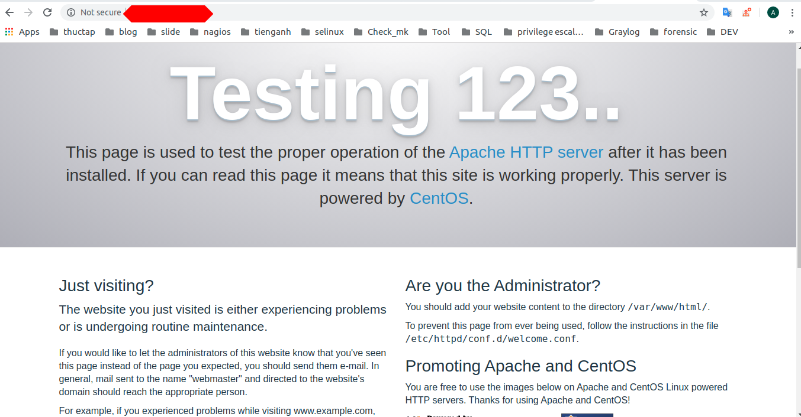
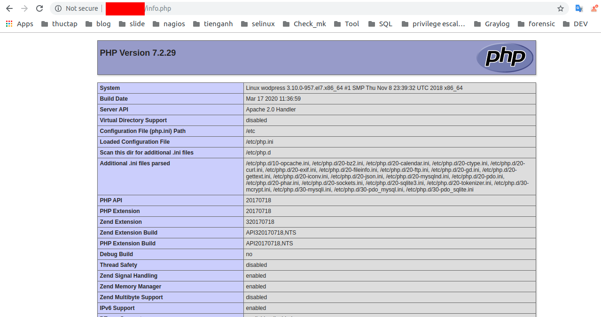
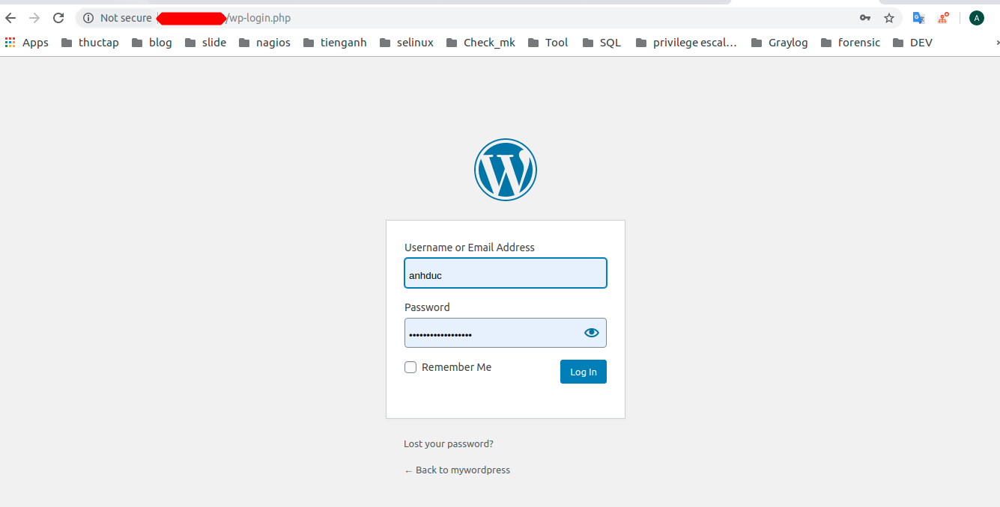

# Hướng dẫn  Cài đặt wordpress trên 1 node 
## I.LAMP là gì?
Lamp thường được dùng để phát triển web server. LAMP là từ viết tắt của Linux, Apache, Mysql, PHP.

1. Cài đặt LAMP
- Để cài đặt LAMP ta tiến hành cài đặt lần lượt các thành phần của nó. Trước tiên ta cần một máy có chạy hệ điều hành Linux.
2. Cài đặt Apache
- Apache là một phần mềm được đặt trên máy chủ web server để xử lý các yêu cầu gửi tới máy đó dưới giao thức HTTP hoặc HTTPs.
- Sử dụng lệnh yum để cài đặt Apache
```
yum install httpd -y
```
Bật dịch vụ Apache và cho phép khởi động cùng hệ thống
```
systemctl start httpd

systemctl enable httpd
```
Tắt firewall
```
systemctl stop firewalld
```
Để kiểm tra ta vào trình duyệt web và truy cập
```
http://địa-chỉ-IP
```



3. Cài đặt Mysql
- Ta thực hiện các lệnh 
```
wget http://repo.mysql.com/mysql-community-release-el7-5.noarch.rpm

rpm -ivh mysql-community-release-el7-5.noarch.rpm

yum install mysql-server
```
- Khởi động Mysql 
```
systemctl start mysqld
```
- Cài đặt tài khoản `root`
``` 
mysql_secure_installation
```

4. Cài đặt PHP 
- Sử dụng lệnh yum để cài đặt 
```
yum install php php-mysql php-gd php-pear -y
```
- Kiểm tra cài đặt bằng kiểm tra version 
```
[root@wodpress ~]# php -v
PHP 7.2.29 (cli) (built: Mar 17 2020 11:36:18) ( NTS )
Copyright (c) 1997-2018 The PHP Group
Zend Engine v3.2.0, Copyright (c) 1998-2018 Zend Technologies
    with Zend OPcache v7.2.29, Copyright (c) 1999-2018, by Zend Technologies
```
- Hoặc thực hiện lệnh để kiểm tra xem đã cài đặt được chưa
```
echo "<?php phpinfo(); ?>" > /var/www/html/info.php
```
Rồi restart lại service httpd 
```
systemctl restart httpd
```
- Truy cập `http://địa chỉ Ip/info.php`



5. Cài wordpress
- Được sử dụng để hỗ trợ tạo ra website
- Để cài Wordpress ta cần cài đặt trước LAMP
- Chạy các lệnh
```
cd /var/www/html/
wget https://wordpress.org/latest.tar.gz
tar xzvf latest.tar.gz
```
- Đăng nhập database để tạo dữ liệu cơ sở 
```
mysql -u root -p
```
- Tạo database
```
create database wordpress;
```
- Tạo user đăng nhập DB
```
create user 'user'@'localhost' identified by 'password';
```
- Gán quyền cho user 
```
grant all privileges on wordpress.* to 'user'@'lcalhost';
```
Cập nhật thay đổi
```
flush privileges;
```
Thoát khỏi mysql
```
exit;
```

6. Cấu hình wordpress kết nối với Database
Đổi tên và chỉnh sửa tập tin cấu hình chính của wordpress
```
cd /var/www/html/

mv wordpress/* /var/www/html/

mv wp-config-sample.php wp-config.php

vi wp-config.php
```
Tìm các dòng sau và thay đồi giá trị phù hợp
```
define('DB_NAME', 'wordpress');   

define('DB_USER', 'user');     

define('DB_PASSWORD', 'password');     
```
- Đăng nhập web kiểm tra

