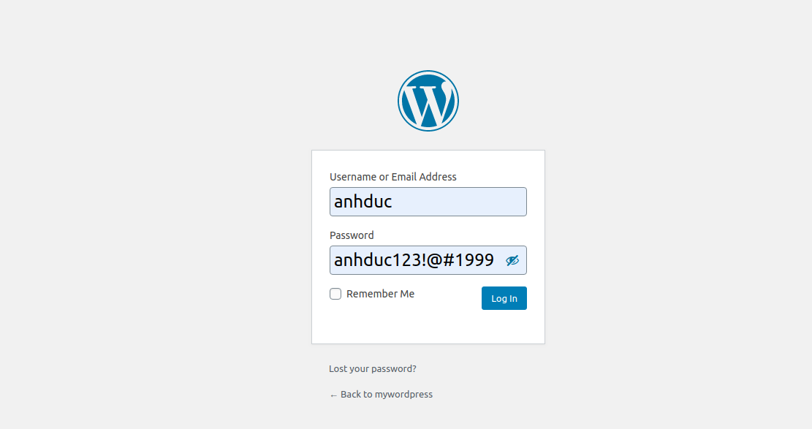
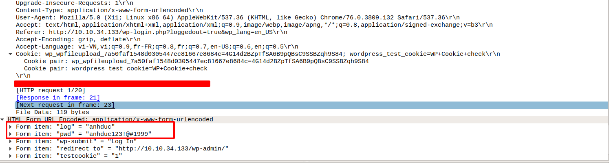
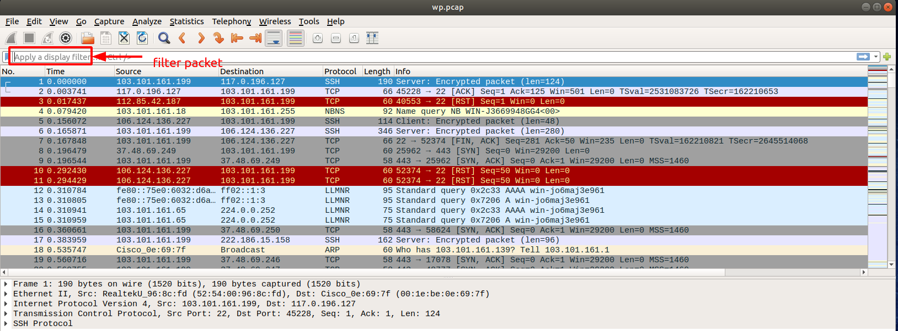

# Thực hiện bắt gói tin đăng nhập Wordpress 
## I. Thực hiện bắt gói tin khi mà chưa có SSL 
1. Kịch bản 
- Đăng nhập từ client tới server Wordpress
- Tại server thực hiện `tcpdump` 
- Dùng wireshark để đọc gói tin xem dữ liệu được mã hóa hay là chưa 

2. Thực hiện
- Bắt gói tin bằng lệnh tcpdump 
```
tcpdump -i eth0 -w wp1.cap
```

- Truy cập wordpress bằng trình duyệt.






- Ở đây ta có thấy rõ được gói tin POST/ HTTP. Và sau đó bấm vào xem nội dung của nó 
- Thì ở đây tôi đã thấy rằng Nó vẫn còn user và password của mình chưa được mã hóa và được gửi đi 

## II. Thực hiện bắt gói tin với wordpress đã có SSL 
1. kịch bản
- Đăng nhập từ client bằng trình duyệt 
- Tại server thực hiện `tcpdump` 
- Dùng wireshark để xem gói tin bắt được. 

2. Thực hiện 
- Bắt gói tin bằng tcpdump
```
tcpdump -i eth0 -w wp.cap
```

- Truy cập wordpress bằng trình duyệt 




- Sau khi đăng nhập xong ta đã bắt được tất cả các gói tin. Nhưng mà ta không thể tìm thấy được bất kỳ gói tin mang giao thức HTTP nào cả.
- Hãy dùng bộ lọc gói tin (filter packet) của wireshark để kiểm chứng điều đó 
- Đó là vì chúng đã được mã hóa. Ta không thể đọc được nội dung của chúng như lúc mà chưa được mã hóa nữa.