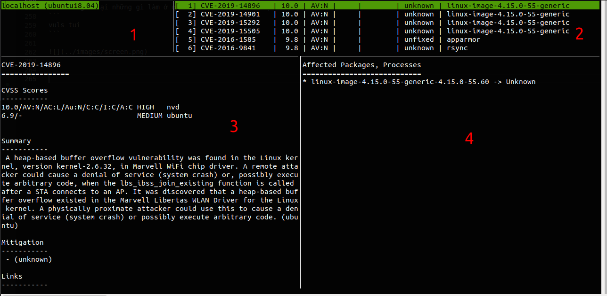
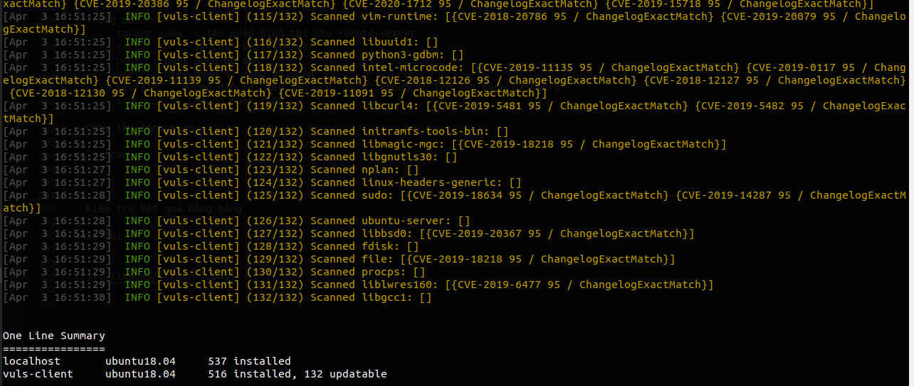
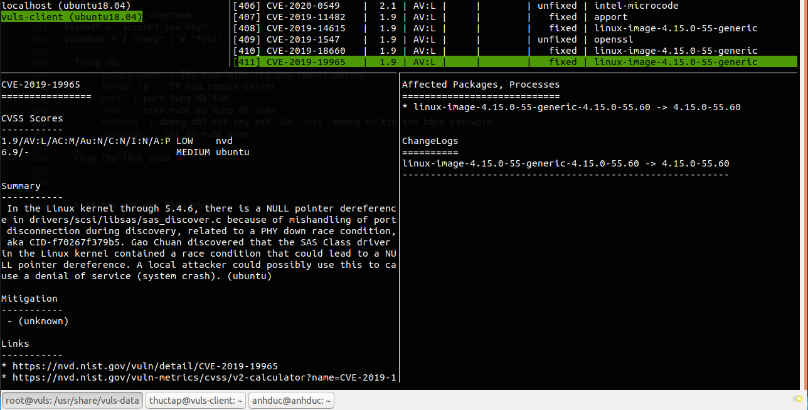
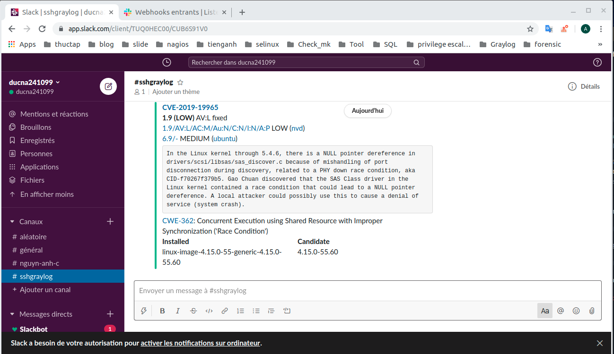

# Tìm hiểu về Vuls 
## I. Khái niệm 
- `Vuls`(vulnerability scanner) là một công cụ được sử dụng để  quét các lỗ hỏng. Nó được viết bằng ngôn ngữ `GO`
- Nó có thể tự động phân tích các lỗ hỏng bảo mật của các phần mềm được cài đặt trên hệ thống. 
- `Vuls` sử dụng nhiều vulnerability databases ví dụ như National Vulnerability Database(NVD); FREEBSD; OVAL;...
- `Vuls` có khả năng quét nhiều hệ thống cùng một lúc và có thể gửi cảnh báo qua e-mail và slack.
- `Vuls` có 3 chế độ được sử dụng để scan: 
    - fast : Thực hiện scan mà không có quyền root 
    - fast root : Thực hiện scan với quyền root 
    - deep : Thực hiện scan với quyền root và xem những thay đổi 
- `Vuls` không thể kiểm soát lưu lượng mạng hoặc là bảo vệ các cuộc tấn công login 
- Nhưng mà nó có thể tự động báo cáo các lỗ hỏng cho các gói được cài trong linux 
- Khi mà DB của `Vuls` đưa ra việc khắc phục lỗ hỏng được phát hiện thì nó cũng đưa vào tin cảnh báo 
- Khi tạo cảnh báo thì `Vuls` sẽ ưu tiên mức độ cảnh báo đã được thiết lập sẵn 

1. Mục tiêu của bài hướng dẫn 
- Trong hướng dẫn này sẽ sử dụng `Vuls` trên ubuntu 18.04 server. 
- Cài đặt cấu hình scan và cảnh báo về slack. 

2. Chuẩn bị 
- Hai máy ubuntu 18.04 tối thiểu 2G RAM. Được chạy dưới quyền root và tài khoản user thường 
 
## II. Thực hiện 
1.  Cài đặt môi trường 
- Tạo thư mục để lưu trữ dữ liệu của  `Vuls`
``` 
sudo mkdir /usr/share/vuls-data
```
- Thay quyền sở hữu cho user thường 
```
sudo chown -R sammy /usr/share/vuls-data
```
- Update các gói 
```
sudo apt update
```
- Cài đặt các gói cần thiết 
```
sudo apt install sqlite git debian-goodies gcc make wget
```
- Cài đặt ngôn ngữ GO. Dùng snap để có thể download được phiên bản mới nhất của GO 
```
sudo snap install go --classic
```
- Tạo file `/etc/profile.d/go-env.sh`. Nó sẽ tự chạy mỗi khi máy mở. Chức năng của nó là tạo ra các biến môi trường 
```
sudo vi /etc/profile.d/go-env.sh
```
với nội dung sau 
```
export GOPATH=$HOME/go
export PATH=$PATH:$GOPATH/bin:/snap/bin
```
- Cấp quyền cho thư mục 
```
sudo chmod +x /etc/profile.d/go-env.sh
```
- Chạy để thực thi file để tránh phải đăng nhập lại 
```
source /etc/profile.d/go-env.sh
```

2. Cài đặt và chạy gói `go-cve-dictionary`
- Gói này sẽ cung cấp quyền truy cập NVD(National Vulnerability Database)
- NVD là kho lưu trữ vulnerabilities và public lớn nhất. Nó có sẵn định dạng cho máy đọc 
- Tạo thư mục để lưu trữ `go-cve-dictionary`
```
mkdir -p $GOPATH/src/github.com/kotakanbe
```
- Di chuyển đến thư mục 
```
cd $GOPATH/src/github.com/kotakanbe
```
- clone `go-cve-dictionary`
```
git clone https://github.com/kotakanbe/go-cve-dictionary.git
```
- Cài đặt `go-cve-dictionary`
```
cd go-cve-dictionary
make install
```
- Để hệ thống có sẵn copy nó vào thư mục của hệ thống
```
sudo cp $GOPATH/bin/go-cve-dictionary /usr/local/bin
```
- Tạo thư mục log cho nó và cấp quyền cho thư mục 
```
sudo mkdir /var/log/vuls

sudo chmod 700 /var/log/vuls

sudo chown -R sammy /var/log/vuls
```
- Download dữ liệu từ NVD về máy
```
for i in `seq 2002 $(date +"%Y")`; do sudo go-cve-dictionary fetchnvd -dbpath /usr/share/vuls-data/cve.sqlite3 -years $i; done
```
**NOTE** : Thời gian làm bước này rất lâu nên hãy đợi nó download 

3. Cài đặt và chạy `goval-dictionary`
- OVAL (Open Vulnerability và Assessment Language) : Được sử dụng để kiểm tra xem có tồn tại các lỗ hỏng trên hệ thống hay là không
- Di chuyển đến thư mục chứa được tạo ra trước đó
```
cd $GOPATH/src/github.com/kotakanbe
```
- Clone gói từ github
```
git clone https://github.com/kotakanbe/goval-dictionary.git
```
- Cài đặt `goval-dictionary`
```
cd goval-dictionary

make install
```
- Sao chép vào thư mục `/usr/local/bin` 
```
sudo cp $GOPATH/bin/goval-dictionary /usr/local/bin
```
- Tìm dữ liệu cho OVAL 
```
sudo goval-dictionary fetch-ubuntu -dbpath=/usr/share/vuls-data/oval.sqlite3 18
```

4. Cài đặt và chạy `gost` 
- Gói này cung cấp quyền truy cập vào trình theo dõi lỗi bảo mật của Debian 
- Tạo ra thư mục mới để lưu trữ 
```
sudo mkdir -p $GOPATH/src/github.com/knqyf263
```
- Di chuyển tới thư mục 
```
cd $GOPATH/src/github.com/knqyf263
```
- Clone nó về từ git
```
sudo git clone https://github.com/knqyf263/gost.git
```
- Cài đặt gói 
```
cd gost

make install
```
- Copy vào thư mục `/usr/local/bin` 
```
sudo cp $GOPATH/bin/gost /usr/local/bin
```
- symlink tới thư mục của vuls để nó có thể thấy được 
```
ln -s $GOPATH/src/github.com/knqyf263/gost/gost.sqlite3  /usr/share/vuls-data/gost.sqlite3
```
- Tạo thư mục log cho `gost`
```
sudo mkdir /var/log/gost
```
- Cấp quyền cho thư mục 
```
sudo chmod 700 /var/log/gost
```
- Cấp quyền cho 1 user thường có thể sử dụng 
```
sudo chown -R sammy /var/log/gost
```
- Tìm dữ liệu và lưu trong bảo mật của Debian 
```
gost fetch debian
```

5. Download và cài đặt `Vuls`
- Tạo ra thư mục lưu trữ 
```
mkdir -p $GOPATH/src/github.com/future-architect
```
- Di chuyển tới thư mục 
```
cd $GOPATH/src/github.com/future-architect
```
- Clone từ github
```
git clone https://github.com/future-architect/vuls.git
```
- Cài đặt thư mục 
```
cd vuls

make install
```
- Copy vào thư mục `/usr/local/bin` 
```
sudo cp $GOPATH/bin/vuls /usr/local/bin
```
- Tạo file cấu hình cho `Vuls` 
```
cd /usr/share/vuls-data

sudo vi config.toml
```
với nội dung sau. Mặc định nó sẽ chạy ở chế độ `fast`
```js
[cveDict]
type = "sqlite3"
SQLite3Path = "/usr/share/vuls-data/cve.sqlite3"

[ovalDict]
type = "sqlite3"
SQLite3Path = "/usr/share/vuls-data/oval.sqlite3"

[gost]
type = "sqlite3"
SQLite3Path = "/usr/share/vuls-data/gost.sqlite3"

[servers]

[servers.localhost]
host = "localhost"
port = "local"
scanMode = [ "fast" ]
#scanMode = ["fast", "fast-root", "deep", "offline"]
```
- Kiểm tra xem cấu hình có đúng hay là không
```
vuls configtest
```

6. Chạy local scan 
- Thực hiện scan trong local nếu không chỉ định rõ ràng sẽ thực hiện ở chế độ `fast`
```
vuls scan
```
output 
```
[Feb 27 19:44:12]  INFO [localhost] Start scanning
[Feb 27 19:44:12]  INFO [localhost] config: /usr/share/vuls-data/config.toml
[Feb 27 19:44:12]  INFO [localhost] Validating config...
[Feb 27 19:44:12]  INFO [localhost] Detecting Server/Container OS...
[Feb 27 19:44:12]  INFO [localhost] Detecting OS of servers...
[Feb 27 19:44:12]  INFO [localhost] (1/1) Detected: localhost: ubuntu 18.04
[Feb 27 19:44:12]  INFO [localhost] Detecting OS of containers...
[Feb 27 19:44:12]  INFO [localhost] Checking Scan Modes...
[Feb 27 19:44:12]  INFO [localhost] Detecting Platforms...
[Feb 27 19:44:12]  INFO [localhost] (1/1) localhost is running on other
[Feb 27 19:44:12]  INFO [localhost] Scanning vulnerabilities...
[Feb 27 19:44:12]  INFO [localhost] Scanning vulnerable OS packages...
[Feb 27 19:44:12]  INFO [localhost] Scanning in fast mode


One Line Summary
================
localhost       ubuntu18.04     537 installed


To view the detail, vuls tui is useful.
To send a report, run vuls report -h.
```

- Nó đã ghi lại những gì làm ở quá trình trên để xem được kết quả 
```
vuls tui
```



- `Number 1` : Liệt kê các máy mà vuls đã scan 
- `Number 2` : Liệt kê danh sách các lỗ hỏng được tìm thấy trong cài đặt 
- `Number 3` : Hiển thị thông tin chi tiết về lỗ hỏng được lấy từ DB 
- `Number 4` : Các gói bị ảnh hưởng và phiên bản của nó 
- Sử dụng `tab` hoặc là `enter` để di chuyển con trỏ sang các bảng.

7. Cấu hình scan nhiều máy 
- Đăng nhập vào remote server và cài đặt 
```
sudo apt install debian-goodies -y
```
- Quay về trở về máy cài đặt `vuls` thêm nội dung vào file `/usr/share/vuls-data/config.toml` 
```
[servers.target_name]
host = "target_ip"
port = "22"
user = "account_username"
keyPath = "account_rsa_key"
scanMode = [ "deep" ] # "fast", "fast-root" or "deep"
```
- Trong đó:
    - `target_name` : Tên muốn hiển thị cho remote-server
    - `target_ip` : IP của remote-server 
    - `port` : port dùng để ssh 
    - `user` : user muốn sử dụng để scan
    - `keyPath` : đường dẫn tới key ssh. Do `vuls` không hỗ trợ ssh bằng password 
    - `scanmode` : Chế độ muốn scan 

- Cấu hình của tôi 
```
[servers.vuls-client]
host = "192.168.80.22"
port = "22"
user = "root"
keyPath = "/root/.ssh/id_rsa"
scanMode = [ "deep" ] # "fast", "fast-root" or "deep"
```

- Chạy thử lệnh scan 
```
vuls scan
```



- Kiểm tra kết quả bằng bảng 
```
vuls tui
```



8. Cài đặt scan và report cho slack 
- Để làm được bước này hãy tạo slack và cài đặt `Incoming Webhooks` 
- Thêm nội dung vào file `/usr/share/vuls-data/config.toml` 
```
[slack]
hookURL      = "your_hook_url"
channel      = "#your_channel_name"
authUser     = "your_username"
```
- Trong đó :
    - `your_hook_url` : là địa chỉ URL của webhook 
    - `#your_channel_name` : Tên kênh mà bạn muốn gửi đến 
    - `your_username` : Tên user tạo ra kênh đó 
- Kiểm tra xem đã kết nối được tới slack chưa 
```
sudo vuls report -to-slack
```
- Lên kênh của slack để check 




- Sau đó có thể dùng `crontab` để có thể chạy được lệnh scan và report theo như lịch trình bạn muốn 
```
0 0 * * * vuls scan -config=/usr/share/vuls-data/config.toml; vuls report -config=/usr/share/vuls-data/config.toml > /dev/null 2>&1
```
- Ví dụ  trên chạy 12h hằng ngày 
- Nó sẽ scan; và report tới file config.toml 
